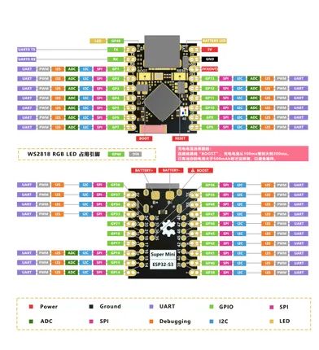

# ESP32-S3 SuperMini

**Nologo** · ESP32-S3

Revision: Not identified  
Coverage: Pinout image collected

[Browse all manufacturers](../../../../BROWSE.md) · [Desktop app](https://github.com/valleytechsolutions/black-wire-desktop)

## Pinout - Nologo documentation

**pinout image** · Reviewed source · JPG

[Open original reference](../../../../library/media/484c336d46e12d9978eda6716bc90c7292b43f94e53ebebe48f1cff58f2448c9.jpg)

**Credit and rights:** Not established; source attribution retained. Source/manufacturer: Nologo.

[Source 1](https://www.nologo.tech/assets/img/esp32/esp32s3supermini/esp32s3foot1.jpg) · [Source 2](https://www.nologo.tech/product/esp32/esp32s3/esp32s3supermini/esp32S3SuperMini.html)

Unchanged image from Nologo catalog documentation. Nologo is the catalog attribution; maker identity is not independently verified for every product it sells. Exact physical PCB must match the source image, not merely the SuperMini name. Source prose contains apparent copied ESP32-C3 CPU/specification text despite identifying ESP32-S3FH4R2; that prose is not adopted as verified technical specifications. The archived pin diagram is unchanged and is not electrically validated.

SHA-256: `484c336d46e12d9978eda6716bc90c7292b43f94e53ebebe48f1cff58f2448c9`

Pin assignments have not been independently electrically verified. Check board revision before wiring.
