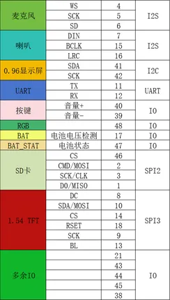

# ESP32-S3 Xingzhi AI

**Nologo** · ESP32-S3

Revision: Not identified  
Coverage: GPIO reference collected; physical pinout needed

[Browse all manufacturers](../../../../BROWSE.md) · [Desktop app](https://github.com/valleytechsolutions/black-wire-desktop)

## GPIO peripheral assignments

**GPIO reference image** · Reviewed source · PNG

[Open original reference](../../../../library/media/4e7c09ed34302f096339fbf6977d538a702519f97d9f45520b413a6abc29f49a.png)

**Credit and rights:** Not established; source attribution retained. Source/manufacturer: Nologo.

[Source 1](https://www.nologo.tech/assets/img/esp32/esp32s3ai/12.png) · [Source 2](https://www.nologo.tech/product/esp32/esp32s3/esp32s3ai/esp32s3ai.html)

Unchanged image from Nologo catalog documentation. Nologo is the catalog attribution; maker identity is not independently verified for every product it sells. Exact physical PCB must match the source image, not merely the SuperMini name.

SHA-256: `4e7c09ed34302f096339fbf6977d538a702519f97d9f45520b413a6abc29f49a`

Pin assignments have not been independently electrically verified. Check board revision before wiring.
