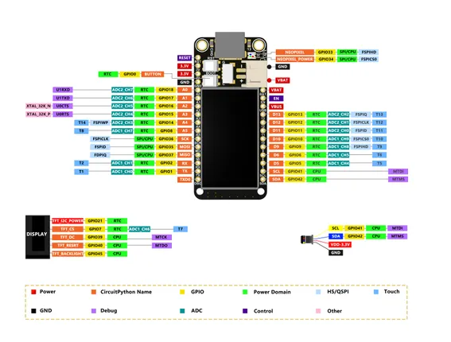
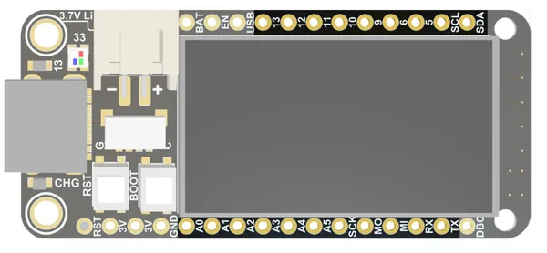

# ESP32-S3 1.14-inch TFT

**Nologo** · ESP32-S31

Revision: Not identified  
Coverage: Pinout image collected

[Browse all manufacturers](../../../../BROWSE.md) · [Desktop app](https://github.com/valleytechsolutions/black-wire-desktop)

## Pinout - Nologo documentation

**pinout image** · Reviewed source · JPG

[Open original reference](../../../../library/media/c0d56164db04109c066977aaaa0e8a08050ad4067d6c2651699b09cb874a0f58.jpg)

**Credit and rights:** Not established; source attribution retained. Source/manufacturer: Nologo.

[Source 1](https://www.nologo.tech/assets/img/esp32/esp32s31.14tft/8.jpg) · [Source 2](https://www.nologo.tech/product/esp32/esp32s3/esp32S31.14TFT/esp32S31.14TFT.html)

Unchanged image from Nologo catalog documentation. Nologo is the catalog attribution; maker identity is not independently verified for every product it sells. Exact physical PCB must match the source image, not merely the SuperMini name.

SHA-256: `c0d56164db04109c066977aaaa0e8a08050ad4067d6c2651699b09cb874a0f58`

## Board labels - Nologo documentation

**board labeling image** · Reviewed source · JPG

[Open original reference](../../../../library/media/e16aba88e06f96872b58f19753ee26a970aad7780bceff6210c7837ea4397d4f.jpg)

**Credit and rights:** Not established; source attribution retained. Source/manufacturer: Nologo.

[Source 1](https://www.nologo.tech/assets/img/esp32/esp32s31.14tft/29.jpg) · [Source 2](https://www.nologo.tech/product/esp32/esp32s3/esp32S31.14TFT/esp32S31.14TFT.html)

Unchanged image from Nologo catalog documentation. Nologo is the catalog attribution; maker identity is not independently verified for every product it sells. Exact physical PCB must match the source image, not merely the SuperMini name.

SHA-256: `e16aba88e06f96872b58f19753ee26a970aad7780bceff6210c7837ea4397d4f`

Pin assignments have not been independently electrically verified. Check board revision before wiring.
