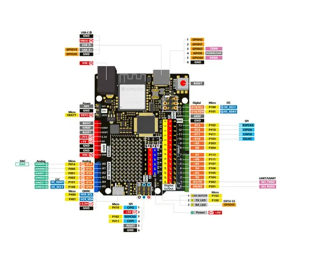

# Arduino Uno R4 WIFI

**Nologo** · Other

Revision: Not identified  
Coverage: Pinout image collected

[Browse all manufacturers](../../../../BROWSE.md) · [Desktop app](https://github.com/valleytechsolutions/black-wire-desktop)

## Pinout - Nologo documentation

**pinout image** · Reviewed source · PNG

[Open original reference](../../../../library/media/eb28caea049ced8814ba3d5ae64fb75972fadefc13e1aa9807e274e56e2794f1.png)

**Credit and rights:** Not established; source attribution retained. Source/manufacturer: Nologo.

[Source 1](https://www.nologo.tech/assets/img/arduino/unor4wifi/1.jpg) · [Source 2](https://www.nologo.tech/product/arduino/ArduinoUnoR4WIFI.html)

Unchanged image from Nologo catalog documentation. Nologo is the catalog attribution; maker identity is not independently verified for every product it sells. Exact physical PCB must match the source image, not merely the SuperMini name.

SHA-256: `eb28caea049ced8814ba3d5ae64fb75972fadefc13e1aa9807e274e56e2794f1`

Pin assignments have not been independently electrically verified. Check board revision before wiring.
