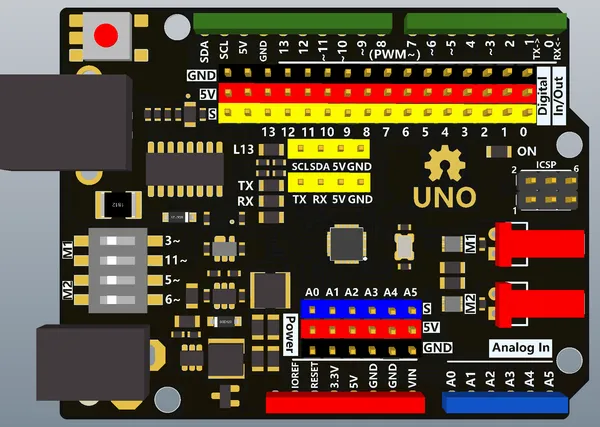

# Arduino UnoPro2M

**Nologo** · Other

Revision: Not identified  
Coverage: Board labels only; pinout needed

[Browse all manufacturers](../../../../BROWSE.md) · [Desktop app](https://github.com/valleytechsolutions/black-wire-desktop)

## Board labels - Nologo documentation

**board labeling image** · Reviewed source · PNG

[Open original reference](../../../../library/media/5acda77557de19b89cac4483545c07d3f620daa8f298afeeff2ac629b1b68de4.png)

**Credit and rights:** Not established; source attribution retained. Source/manufacturer: Nologo.

[Source 1](https://www.nologo.tech/assets/img/arduino/uno/UnoPro2MFoot.png) · [Source 2](https://www.nologo.tech/product/arduino/arduinoUnoPro2M.html)

Unchanged image from Nologo catalog documentation. Nologo is the catalog attribution; maker identity is not independently verified for every product it sells. Exact physical PCB must match the source image, not merely the SuperMini name.

SHA-256: `5acda77557de19b89cac4483545c07d3f620daa8f298afeeff2ac629b1b68de4`

Pin assignments have not been independently electrically verified. Check board revision before wiring.
