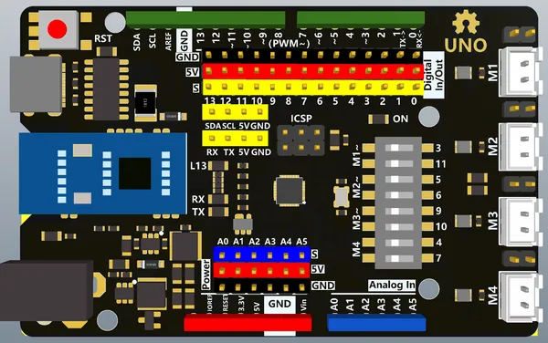

# Arduino UnoPro4M

**Nologo** · Other

Revision: Not identified

Coverage: Board labels only; pinout needed

[Browse all manufacturers](../../../../BROWSE.md) · [Devices & IoT](../../../../DEVICES.md) · [Open in the browser guide](https://valleytech-black-wire-guide.pages.dev/?board=nologo-other-arduino-unopro4m)

## Datasheets and original documentation

Board datasheet: **not yet recorded**. Visual reference: **available**.

Original manufacturer website still needs identification.

A chip datasheet, schematic and board datasheet have different scopes. Match the exact hardware revision.

[Documentation coverage and remaining gaps](../../../../DOCUMENTATION.md)

## Board labels - Nologo documentation

**board labeling image** · Reviewed source · PNG

[Open original reference](../../../../library/media/d6255802154abfecd00149a25c7201b2b87bb1de7f2bd3b03789f96120752011.png)

**Credit and rights:** Not established; source attribution retained. Source/manufacturer: Nologo.

[Source 1](https://www.nologo.tech/assets/img/arduino/uno/UnoPro4MFoot.png) · [Source 2](https://www.nologo.tech/product/arduino/arduinoUnoPro4M.html)

Unchanged image from Nologo catalog documentation. Nologo is the catalog attribution; maker identity is not independently verified for every product it sells. Exact physical PCB must match the source image, not merely the SuperMini name.

Image revision: Not identified

SHA-256: `d6255802154abfecd00149a25c7201b2b87bb1de7f2bd3b03789f96120752011`

Pin assignments have not been independently electrically verified. Check board revision before wiring.
