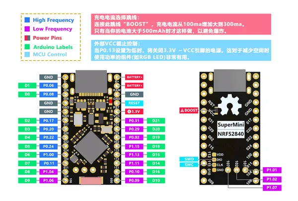

# ProMicro NRF52840 (formerly SuperMini)

**Nologo** · Other

Revision: Not identified  
Coverage: Pinout image collected

[Browse all manufacturers](../../../../BROWSE.md) · [Desktop app](https://github.com/valleytechsolutions/black-wire-desktop)

## Pinout - Nologo documentation

**pinout image** · Reviewed source · JPG

[Open original reference](../../../../library/media/6f8e663d325402a364a95712269be36252cad1e9c51d73cee72641ae2729021d.jpg)

**Credit and rights:** Not established; source attribution retained. Source/manufacturer: Nologo.

[Source 1](https://www.nologo.tech/assets/img/other/NRF52840/ProMicroNRF52840Foot.jpg) · [Source 2](https://www.nologo.tech/product/otherboard/NRF52840.html)

Unchanged image from Nologo catalog documentation. Nologo is the catalog attribution; maker identity is not independently verified for every product it sells. Exact physical PCB must match the source image, not merely the SuperMini name. Documentation states the name changed from SuperMini NRF52840 to ProMicro52840 after 2023-09-28. Preserve PCB-name differences when matching a device.

SHA-256: `6f8e663d325402a364a95712269be36252cad1e9c51d73cee72641ae2729021d`

Pin assignments have not been independently electrically verified. Check board revision before wiring.
