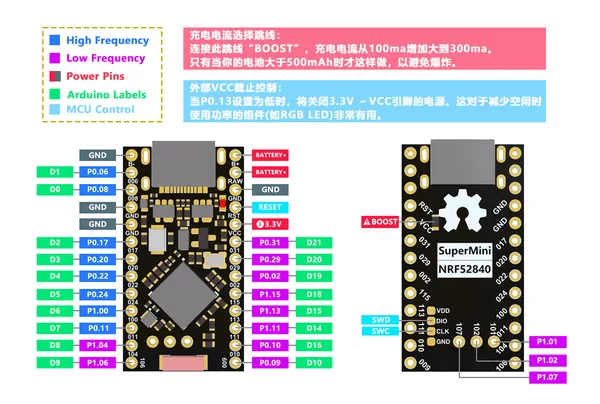

# ProMicro NRF52840 (formerly SuperMini)

**Nologo** · Other

Revision: Not identified

Coverage: Pinout image collected

[Browse all manufacturers](../../../../BROWSE.md) · [Devices & IoT](../../../../DEVICES.md) · [Open in the browser guide](https://valleytech-black-wire-guide.pages.dev/?board=nologo-other-promicro-nrf52840-formerly-supermini)

## Datasheets and original documentation

Board datasheet: **not yet recorded**. Visual reference: **available**.

Original manufacturer website still needs identification.

A chip datasheet, schematic and board datasheet have different scopes. Match the exact hardware revision.

[Documentation coverage and remaining gaps](../../../../DOCUMENTATION.md)

## Pinout - Nologo documentation

**pinout image** · Reviewed source · JPG

[Open original reference](../../../../library/media/6f8e663d325402a364a95712269be36252cad1e9c51d73cee72641ae2729021d.jpg)

**Credit and rights:** Not established; source attribution retained. Source/manufacturer: Nologo.

[Source 1](https://www.nologo.tech/assets/img/other/NRF52840/ProMicroNRF52840Foot.jpg) · [Source 2](https://www.nologo.tech/product/otherboard/NRF52840.html)

Unchanged image from Nologo catalog documentation. Nologo is the catalog attribution; maker identity is not independently verified for every product it sells. Exact physical PCB must match the source image, not merely the SuperMini name. Documentation states the name changed from SuperMini NRF52840 to ProMicro52840 after 2023-09-28. Preserve PCB-name differences when matching a device.

Image revision: Not identified

SHA-256: `6f8e663d325402a364a95712269be36252cad1e9c51d73cee72641ae2729021d`

Pin assignments have not been independently electrically verified. Check board revision before wiring.
