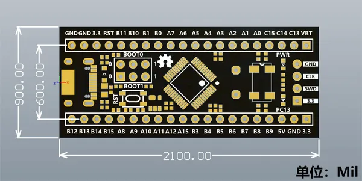

# STM32F103C8T6

**Nologo** · Other

Revision: Not identified  
Coverage: Board labels only; pinout needed

[Browse all manufacturers](../../../../BROWSE.md) · [Desktop app](https://github.com/valleytechsolutions/black-wire-desktop)

## Board labels - Nologo documentation

**board labeling image** · Reviewed source · PNG

[Open original reference](../../../../library/media/3f20f7bbe63e0fca696f317f61a528929f33e6110922fb3d287ff9074a6e87ec.png)

**Credit and rights:** Not established; source attribution retained. Source/manufacturer: Nologo.

[Source 1](https://www.nologo.tech/assets/img/stm32/stm32c6t6c8t6/dimension.png) · [Source 2](https://www.nologo.tech/product/stm32/stm32f103c8t6.html)

Unchanged image from Nologo catalog documentation. Nologo is the catalog attribution; maker identity is not independently verified for every product it sells. Exact physical PCB must match the source image, not merely the SuperMini name.

SHA-256: `3f20f7bbe63e0fca696f317f61a528929f33e6110922fb3d287ff9074a6e87ec`

Pin assignments have not been independently electrically verified. Check board revision before wiring.
