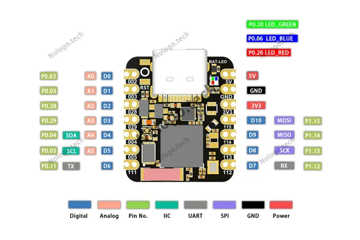
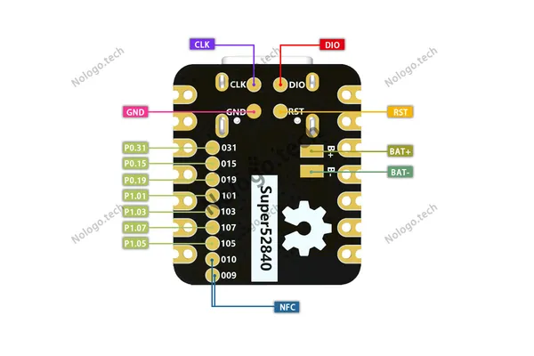

# Super nRF52840

**Nologo** · Other

Revision: Not identified  
Coverage: Pinout image collected

[Browse all manufacturers](../../../../BROWSE.md) · [Desktop app](https://github.com/valleytechsolutions/black-wire-desktop)

## Pinout - Nologo documentation

**pinout image** · Reviewed source · JPG

[Open original reference](../../../../library/media/5fb27580b3d4e38b2b6850f399d1a75aa93b6f3cee33b0ca6c48af91505a5ef3.jpg)

**Credit and rights:** Not established; source attribution retained. Source/manufacturer: Nologo.

[Source 1](https://www.nologo.tech/assets/img/keyboard/keyboard_controll/super52840/10.png) · [Source 2](https://www.nologo.tech/product/keyboard/keyboard_controll/super52840/super528401.html)

Unchanged image from Nologo catalog documentation. Nologo is the catalog attribution; maker identity is not independently verified for every product it sells. Exact physical PCB must match the source image, not merely the SuperMini name.

SHA-256: `5fb27580b3d4e38b2b6850f399d1a75aa93b6f3cee33b0ca6c48af91505a5ef3`

## Underside pad pinout

**pinout image** · Reviewed source · JPG

[Open original reference](../../../../library/media/a46f3c7267640775fbe7c40d83d888415592583c66cb760ba7b62dd6306f26ad.jpg)

**Credit and rights:** Not established; source attribution retained. Source/manufacturer: Nologo.

[Source 1](https://www.nologo.tech/assets/img/keyboard/keyboard_controll/super52840/9.png) · [Source 2](https://www.nologo.tech/product/keyboard/keyboard_controll/super52840/super528401.html)

Unchanged image from Nologo catalog documentation. Nologo is the catalog attribution; maker identity is not independently verified for every product it sells. Exact physical PCB must match the source image, not merely the SuperMini name.

**Partial diagram. Confirm missing pins against the exact board documentation.**

SHA-256: `a46f3c7267640775fbe7c40d83d888415592583c66cb760ba7b62dd6306f26ad`

Pin assignments have not been independently electrically verified. Check board revision before wiring.
