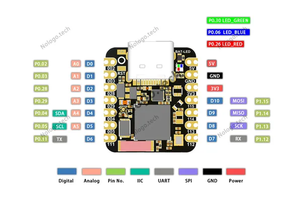
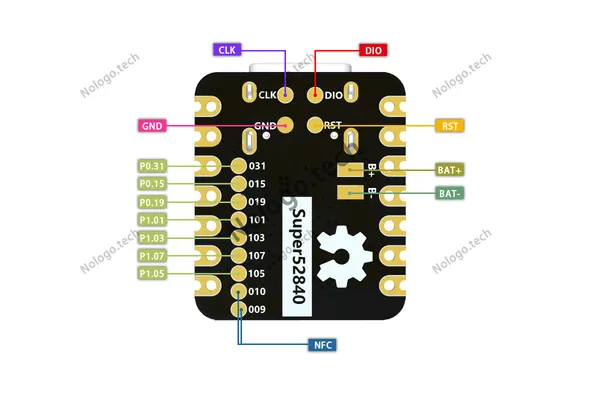

# Super nRF52840

**Nologo** · Other

Revision: Not identified

Coverage: Pinout image collected

[Browse all manufacturers](../../../../BROWSE.md) · [Devices & IoT](../../../../DEVICES.md) · [Open in the browser guide](https://valleytech-black-wire-guide.pages.dev/?board=nologo-other-super-nrf52840)

## Datasheets and original documentation

Board datasheet: **not yet recorded**. Visual reference: **available**.

Original manufacturer website still needs identification.

A chip datasheet, schematic and board datasheet have different scopes. Match the exact hardware revision.

[Documentation coverage and remaining gaps](../../../../DOCUMENTATION.md)

## Pinout - Nologo documentation

**pinout image** · Reviewed source · JPG

[Open original reference](../../../../library/media/5fb27580b3d4e38b2b6850f399d1a75aa93b6f3cee33b0ca6c48af91505a5ef3.jpg)

**Credit and rights:** Not established; source attribution retained. Source/manufacturer: Nologo.

[Source 1](https://www.nologo.tech/assets/img/keyboard/keyboard_controll/super52840/10.png) · [Source 2](https://www.nologo.tech/product/keyboard/keyboard_controll/super52840/super528401.html)

Unchanged image from Nologo catalog documentation. Nologo is the catalog attribution; maker identity is not independently verified for every product it sells. Exact physical PCB must match the source image, not merely the SuperMini name.

Image revision: Not identified

SHA-256: `5fb27580b3d4e38b2b6850f399d1a75aa93b6f3cee33b0ca6c48af91505a5ef3`

## Underside pad pinout

**pinout image** · Reviewed source · JPG

[Open original reference](../../../../library/media/a46f3c7267640775fbe7c40d83d888415592583c66cb760ba7b62dd6306f26ad.jpg)

**Credit and rights:** Not established; source attribution retained. Source/manufacturer: Nologo.

[Source 1](https://www.nologo.tech/assets/img/keyboard/keyboard_controll/super52840/9.png) · [Source 2](https://www.nologo.tech/product/keyboard/keyboard_controll/super52840/super528401.html)

Unchanged image from Nologo catalog documentation. Nologo is the catalog attribution; maker identity is not independently verified for every product it sells. Exact physical PCB must match the source image, not merely the SuperMini name.

Image revision: Not identified

SHA-256: `a46f3c7267640775fbe7c40d83d888415592583c66cb760ba7b62dd6306f26ad`

Pin assignments have not been independently electrically verified. Check board revision before wiring.
