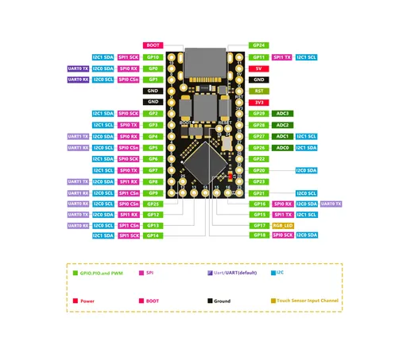

# RP2040 ProMicro

**Nologo** · RP2040

Revision: Not identified  
Coverage: Pinout image collected

[Browse all manufacturers](../../../../BROWSE.md) · [Desktop app](https://github.com/valleytechsolutions/black-wire-desktop)

## Pinout - Nologo documentation

**pinout image** · Reviewed source · PNG

[Open original reference](../../../../library/media/12a80ea94874ac87499bf1b505c1abe36d0392d5fc22d13fbc76f21f049f1dcc.png)

**Credit and rights:** Not established; source attribution retained. Source/manufacturer: Nologo.

[Source 1](https://www.nologo.tech/assets/img/raspberrypie/RP2040ProMicro/RP2040ProMicroFoot.jpg) · [Source 2](https://www.nologo.tech/product/raspberrypie/RP2040/RP2040ProMicro.html)

Unchanged image from Nologo catalog documentation. Nologo is the catalog attribution; maker identity is not independently verified for every product it sells. Exact physical PCB must match the source image, not merely the SuperMini name.

SHA-256: `12a80ea94874ac87499bf1b505c1abe36d0392d5fc22d13fbc76f21f049f1dcc`

Pin assignments have not been independently electrically verified. Check board revision before wiring.
