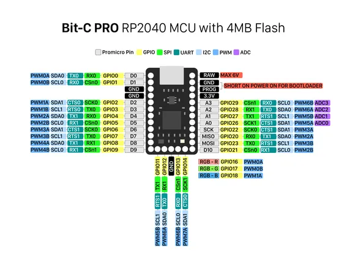

# Bit-C PRO

**nullbits** · RP2040

Revision: Not identified  
Coverage: Pinout image collected

[Browse all manufacturers](../../../../BROWSE.md) · [Desktop app](https://github.com/valleytechsolutions/black-wire-desktop)

## Physical board pinout

**pinout image** · Reviewed source · PNG

[Open original reference](../../../../library/media/1ef7bc3864f9de93e9e1d1d6a66c2c882e518012d3250526c2ddb95a48a130df.png)

**Credit and rights:** Not established; source attribution retained. Source/manufacturer: nullbits.

[Source 1](https://nullbits.co/static/img/bitc_pro_pinout.png) · [Source 2](https://nullbits.co/bit-c-pro/)

Discovered from CircuitPython board metadata and the linked product/documentation page. Exact hardware revision requires matching to the diagram.

SHA-256: `1ef7bc3864f9de93e9e1d1d6a66c2c882e518012d3250526c2ddb95a48a130df`

Pin assignments have not been independently electrically verified. Check board revision before wiring.
