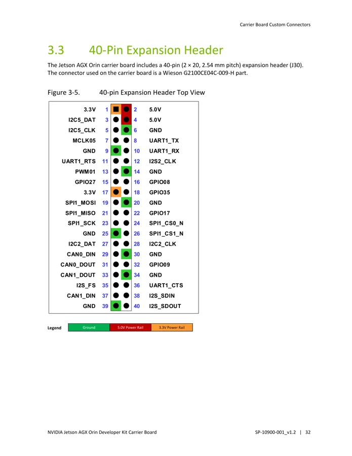
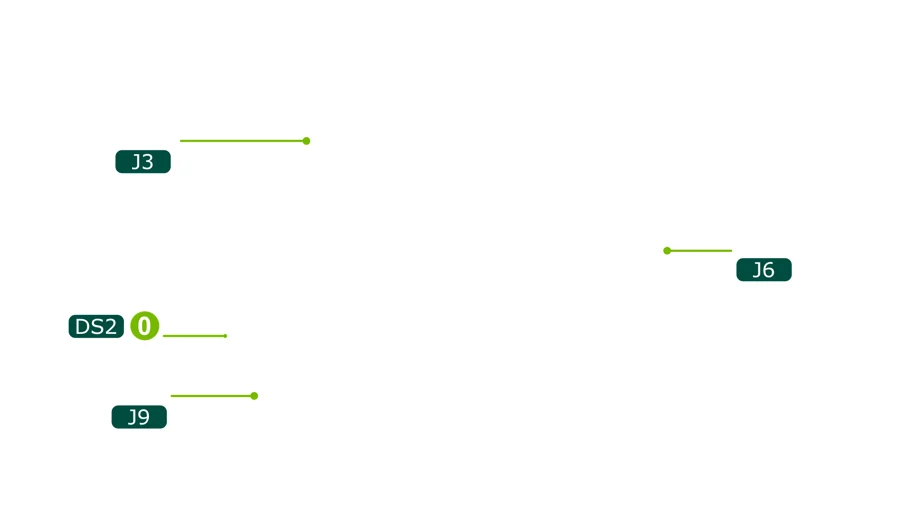

# Jetson AGX Orin Developer Kit

**NVIDIA** · Other SBC

Revision: Carrier revision: match source; document version 1.2

Coverage: Physical pinout source collected; check exact connector scope and revision

[Browse all manufacturers](../../../../BROWSE.md) · [Devices & IoT](../../../../DEVICES.md) · [Open in the browser guide](https://valleytech-black-wire-guide.pages.dev/?board=nvidia-other-jetson-agx-orin-developer-kit)

Architecture: **ARM**

## Datasheets and original documentation

Board datasheet: **recorded**. Visual reference: **available**.

[Original manufacturer hardware website](https://docs.nvidia.com/jetson/agx-orin-devkit/user-guide/hardware_layout.html)

- **datasheet / board**: [Jetson AGX Orin Developer Kit Carrier Board Specification](https://developer.nvidia.com/assets/embedded/secure/jetson/agx_orin/jetson_agx_orin_devkit_carrier_board_specification_sp) · [saved document](../../../../library/media/d817a69767b9e11efaa9b54037b87039a16bff3e5a7c41255ce3b75e47322cac.pdf)

Match the exact board, carrier and PCB revision. A component datasheet does not define the board header or input-power limits.

[Documentation coverage and remaining gaps](../../../../DOCUMENTATION.md)

## Specifications and hardware documentation

- [Manufacturer specifications & hardware guide](https://docs.nvidia.com/jetson/agx-orin-devkit/user-guide/hardware_layout.html)

## Jetson AGX Orin Developer Kit Carrier Board Specification

**original reference PDF** · Reviewed source · PDF

[Open original reference](../../../../library/media/d817a69767b9e11efaa9b54037b87039a16bff3e5a7c41255ce3b75e47322cac.pdf)

**Credit and rights:** NVIDIA / original reference contributors. Asset-specific redistribution and print rights have not been established. Original artwork is not relicensed by the Black Wire editorial license.. Source/manufacturer: NVIDIA.

[Source 1](https://developer.nvidia.com/assets/embedded/secure/jetson/agx_orin/jetson_agx_orin_devkit_carrier_board_specification_sp) · [Source 2](https://docs.nvidia.com/jetson/agx-orin-devkit/user-guide/hardware_layout.html) · [Source 3](https://www.waveshare.com/wiki/Jetson_AGX_Orin_Developer_Kit)

Only the connectors and PCB revision shown are covered. Match physical orientation and electrical limits in the manufacturer hardware guide.

Image revision: Document version 1.2; match carrier PCB revision

SHA-256: `d817a69767b9e11efaa9b54037b87039a16bff3e5a7c41255ce3b75e47322cac`

## J30 40-pin expansion header — carrier specification p37

**pinout image** · Reviewed source · PNG

[Open original reference](../../../../library/media/da9169a7d96e9aa29b4d9200b5d1c593676b236a6462a348126848e755f689c7.png)

**Credit and rights:** NVIDIA / original reference contributors. Asset-specific redistribution and print rights have not been established. Original artwork is not relicensed by the Black Wire editorial license.. Source/manufacturer: NVIDIA.

[Source 1](https://developer.nvidia.com/assets/embedded/secure/jetson/agx_orin/jetson_agx_orin_devkit_carrier_board_specification_sp) · [Source 2](https://docs.nvidia.com/jetson/agx-orin-devkit/user-guide/hardware_layout.html) · [Source 3](https://www.waveshare.com/wiki/Jetson_AGX_Orin_Developer_Kit)

Only the connectors and PCB revision shown are covered. Match physical orientation and electrical limits in the manufacturer hardware guide. Original PDF page rendered at 144 dpi; original PDF retained unchanged.

Image revision: Document version 1.2; match carrier PCB revision

SHA-256: `da9169a7d96e9aa29b4d9200b5d1c593676b236a6462a348126848e755f689c7`

## Manufacturer carrier / developer kit layout

**board labeling image** · Reviewed source · PNG

[Open original reference](../../../../library/media/747012d3678b7d9822ea2f498ab2422c304884f442b4bdc12bbb392989f778be.png)

**Credit and rights:** NVIDIA / original reference contributors. Asset-specific redistribution and print rights have not been established. Original artwork is not relicensed by the Black Wire editorial license.. Source/manufacturer: NVIDIA.

[Source 1](https://docs.nvidia.com/jetson/agx-orin-devkit/user-guide/_images/jaodk_carrier_board_top_wire-in-white.png) · [Source 2](https://docs.nvidia.com/jetson/agx-orin-devkit/user-guide/hardware_layout.html) · [Source 3](https://www.waveshare.com/wiki/Jetson_AGX_Orin_Developer_Kit)

Only the connectors and PCB revision shown are covered. Match physical orientation and electrical limits in the manufacturer hardware guide.

Image revision: Document version 1.2; match carrier PCB revision

SHA-256: `747012d3678b7d9822ea2f498ab2422c304884f442b4bdc12bbb392989f778be`

Pin assignments have not been independently electrically verified. Check board revision before wiring.
