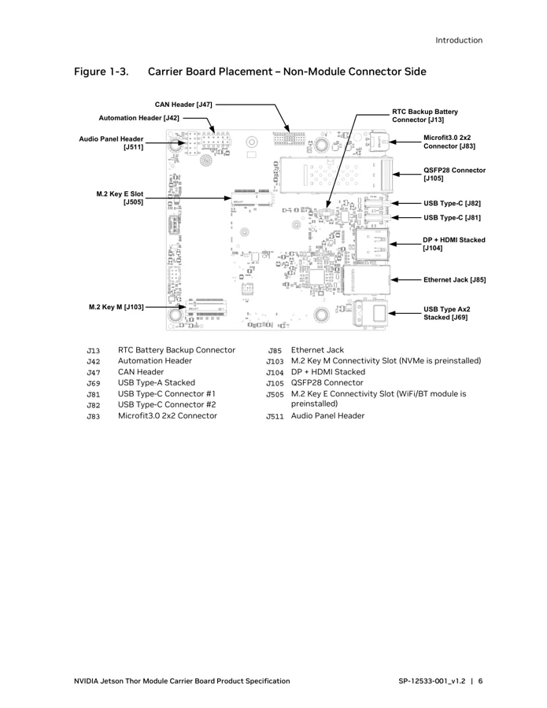
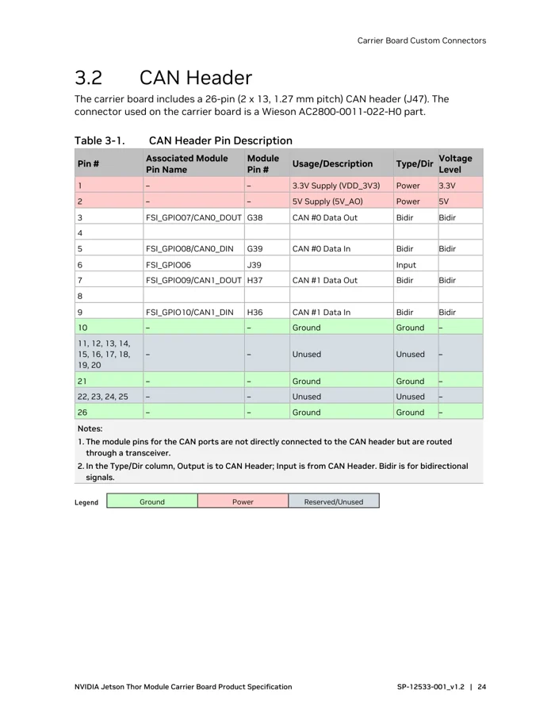
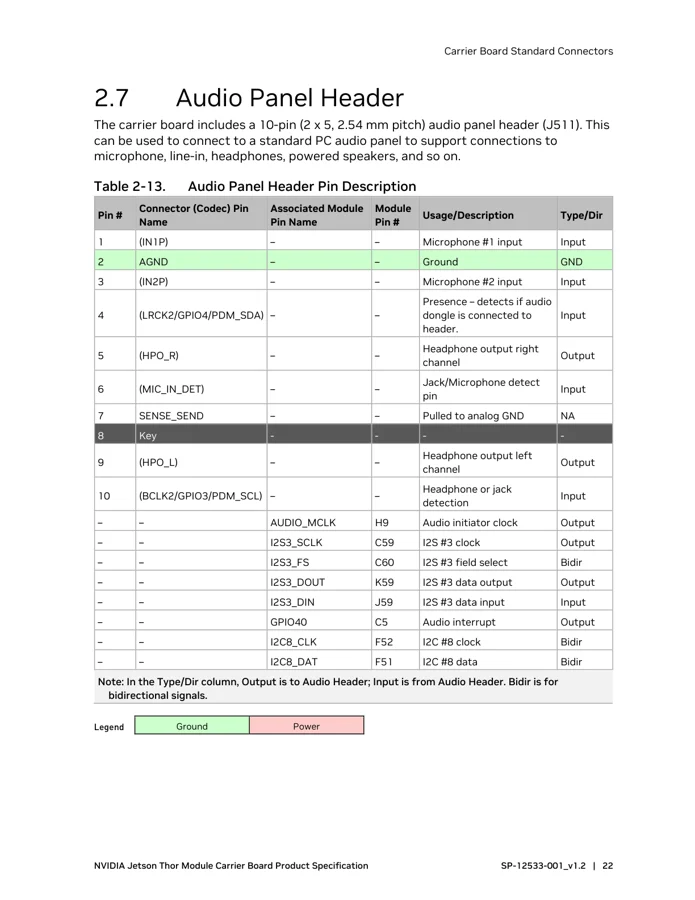

# Jetson AGX Thor Developer Kit

**NVIDIA** · Other SBC

Revision: See document version and carrier model

Coverage: Supporting references collected; physical GPIO map still needed

[Browse all manufacturers](../../../../BROWSE.md) · [Devices & IoT](../../../../DEVICES.md) · [Open in the browser guide](https://valleytech-black-wire-guide.pages.dev/?board=nvidia-other-jetson-agx-thor-developer-kit)

Architecture: **ARM**

## Datasheets and original documentation

Board datasheet: **recorded**. Visual reference: **available**.

[Original manufacturer hardware website](https://docs.nvidia.com/jetson/agx-thor-devkit/user-guide/latest/hardware_layout.html)

- **datasheet / board**: [Jetson Thor Module Carrier Board Specification](https://developer.nvidia.com/downloads/assets/embedded/secure/jetson/thor/docs/jetson-thor-developer-kit-carrier-board-specification.pdf) · [saved document](../../../../library/media/707e06290af1cb3be046957437d9c0af2f85e95304ee5ad1cfdead9d803762ca.pdf)

Thor uses different expansion connectors from the 40-pin Orin carrier headers. J47 CAN and J511 audio tables are partial connector references; do not apply an Orin header map.

[Documentation coverage and remaining gaps](../../../../DOCUMENTATION.md)

## Specifications and hardware documentation

- [Manufacturer specifications & hardware guide](https://docs.nvidia.com/jetson/agx-thor-devkit/user-guide/latest/hardware_layout.html)

## Jetson Thor Module Carrier Board Specification

**original reference PDF** · Reviewed source · PDF

[Open original reference](../../../../library/media/707e06290af1cb3be046957437d9c0af2f85e95304ee5ad1cfdead9d803762ca.pdf)

**Credit and rights:** NVIDIA / original reference contributors. Asset-specific redistribution and print rights have not been established. Original artwork is not relicensed by the Black Wire editorial license.. Source/manufacturer: NVIDIA.

[Source 1](https://developer.nvidia.com/downloads/assets/embedded/secure/jetson/thor/docs/jetson-thor-developer-kit-carrier-board-specification.pdf) · [Source 2](https://docs.nvidia.com/jetson/agx-thor-devkit/user-guide/latest/hardware_layout.html) · [Source 3](https://www.waveshare.com/wiki/Jetson_AGX_Thor_Developer_Kit)

Only the connectors and PCB revision shown are covered. Match physical orientation and electrical limits in the manufacturer hardware guide.

Image revision: See document version and carrier model

SHA-256: `707e06290af1cb3be046957437d9c0af2f85e95304ee5ad1cfdead9d803762ca`

## Carrier connector locations — specification p10

**board labeling image** · Reviewed source · PNG

[Open original reference](../../../../library/media/0279db5a7608549c77a344ffdd965178acd337cfd4d665cfe492f5bdad11e9c9.png)

**Credit and rights:** NVIDIA / original reference contributors. Asset-specific redistribution and print rights have not been established. Original artwork is not relicensed by the Black Wire editorial license.. Source/manufacturer: NVIDIA.

[Source 1](https://developer.nvidia.com/downloads/assets/embedded/secure/jetson/thor/docs/jetson-thor-developer-kit-carrier-board-specification.pdf) · [Source 2](https://docs.nvidia.com/jetson/agx-thor-devkit/user-guide/latest/hardware_layout.html) · [Source 3](https://www.waveshare.com/wiki/Jetson_AGX_Thor_Developer_Kit)

Only the connectors and PCB revision shown are covered. Match physical orientation and electrical limits in the manufacturer hardware guide. Original PDF page rendered at 144 dpi; original PDF retained unchanged.

Image revision: See document version and carrier model

SHA-256: `0279db5a7608549c77a344ffdd965178acd337cfd4d665cfe492f5bdad11e9c9`

## J47 CAN header signal table — specification p28

**pin function reference** · Reviewed source · PNG

[Open original reference](../../../../library/media/ce79796bf9039aa99bb6d6f73a89d76bd4739e1994c4a37028d537a3307ab3cd.png)

**Credit and rights:** NVIDIA / original reference contributors. Asset-specific redistribution and print rights have not been established. Original artwork is not relicensed by the Black Wire editorial license.. Source/manufacturer: NVIDIA.

[Source 1](https://developer.nvidia.com/downloads/assets/embedded/secure/jetson/thor/docs/jetson-thor-developer-kit-carrier-board-specification.pdf) · [Source 2](https://docs.nvidia.com/jetson/agx-thor-devkit/user-guide/latest/hardware_layout.html) · [Source 3](https://www.waveshare.com/wiki/Jetson_AGX_Thor_Developer_Kit)

Only the connectors and PCB revision shown are covered. Match physical orientation and electrical limits in the manufacturer hardware guide. Original PDF page rendered at 144 dpi; original PDF retained unchanged.

Image revision: See document version and carrier model

SHA-256: `ce79796bf9039aa99bb6d6f73a89d76bd4739e1994c4a37028d537a3307ab3cd`

## J511 audio header signal table — specification p26

**pin function reference** · Reviewed source · PNG

[Open original reference](../../../../library/media/a4d9b656db950bcc38ed656e77ec0874280b824c7e3e44a1cd1e351fee041c5f.png)

**Credit and rights:** NVIDIA / original reference contributors. Asset-specific redistribution and print rights have not been established. Original artwork is not relicensed by the Black Wire editorial license.. Source/manufacturer: NVIDIA.

[Source 1](https://developer.nvidia.com/downloads/assets/embedded/secure/jetson/thor/docs/jetson-thor-developer-kit-carrier-board-specification.pdf) · [Source 2](https://docs.nvidia.com/jetson/agx-thor-devkit/user-guide/latest/hardware_layout.html) · [Source 3](https://www.waveshare.com/wiki/Jetson_AGX_Thor_Developer_Kit)

Only the connectors and PCB revision shown are covered. Match physical orientation and electrical limits in the manufacturer hardware guide. Original PDF page rendered at 144 dpi; original PDF retained unchanged.

Image revision: See document version and carrier model

SHA-256: `a4d9b656db950bcc38ed656e77ec0874280b824c7e3e44a1cd1e351fee041c5f`

Pin assignments have not been independently electrically verified. Check board revision before wiring.
