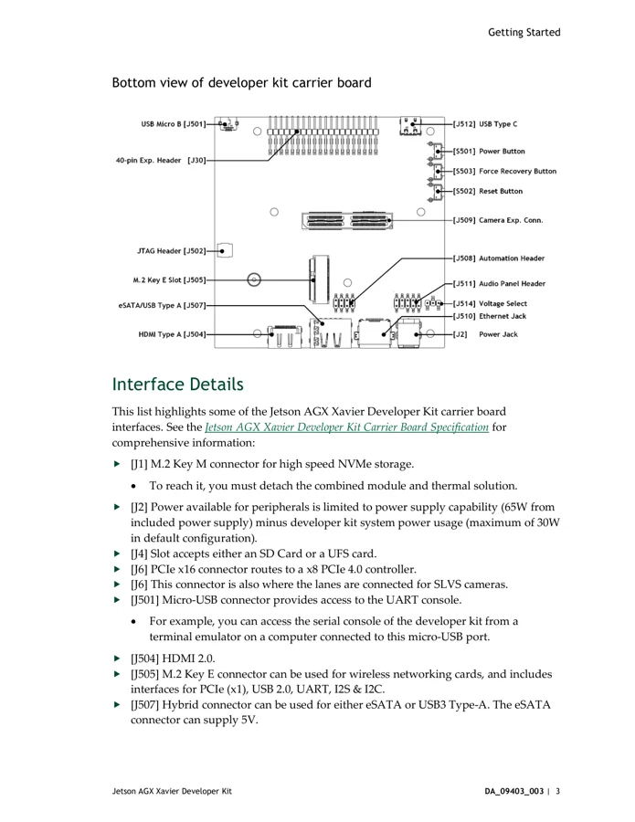

# Jetson AGX Xavier Developer Kit

**NVIDIA** · Other SBC

Revision: Carrier revision: match source; document version 3.0

Coverage: Supporting references collected; physical GPIO map still needed

[Browse all manufacturers](../../../../BROWSE.md) · [Devices & IoT](../../../../DEVICES.md) · [Open in the browser guide](https://valleytech-black-wire-guide.pages.dev/?board=nvidia-other-jetson-agx-xavier-developer-kit)

Architecture: **ARM**

## Datasheets and original documentation

Board datasheet: **not yet recorded**. Visual reference: **available**.

[Original manufacturer hardware website](https://developer.nvidia.com/embedded/downloads#?search=Jetson%20AGX%20Xavier%20Developer%20Kit%20User%20Guide)

- **hardware-guide / board**: [Jetson AGX Xavier Developer Kit User Guide](https://developer.nvidia.com/embedded/dlc/jetson_agx_xavier_developer_kit_user_guide) · [saved document](../../../../library/media/18b8de4ff56f482af06f7e0ff3b1118b167d776c776d180f0fb4497da3584aca.pdf)

Match the exact board, carrier and PCB revision. A component datasheet does not define the board header or input-power limits.

[Documentation coverage and remaining gaps](../../../../DOCUMENTATION.md)

## Specifications and hardware documentation

- [Manufacturer specifications & hardware guide](https://developer.nvidia.com/embedded/downloads#?search=Jetson%20AGX%20Xavier%20Developer%20Kit%20User%20Guide)

## Jetson AGX Xavier Developer Kit User Guide

**original reference PDF** · Reviewed source · PDF

[Open original reference](../../../../library/media/18b8de4ff56f482af06f7e0ff3b1118b167d776c776d180f0fb4497da3584aca.pdf)

**Credit and rights:** NVIDIA / original reference contributors. Asset-specific redistribution and print rights have not been established. Original artwork is not relicensed by the Black Wire editorial license.. Source/manufacturer: NVIDIA.

[Source 1](https://developer.nvidia.com/embedded/dlc/jetson_agx_xavier_developer_kit_user_guide) · [Source 2](https://developer.nvidia.com/embedded/downloads#?search=Jetson%20AGX%20Xavier%20Developer%20Kit%20User%20Guide) · [Source 3](https://www.waveshare.com/wiki/Jetson_AGX_Xavier_Developer_Kit)

Only the connectors and PCB revision shown are covered. Match physical orientation and electrical limits in the manufacturer hardware guide.

Image revision: Document version 3.0; match carrier PCB revision

SHA-256: `18b8de4ff56f482af06f7e0ff3b1118b167d776c776d180f0fb4497da3584aca`

## Carrier connector locations — user guide p6

**board labeling image** · Reviewed source · PNG

[Open original reference](../../../../library/media/797111a7494c233825a71c4eac386759e3a465cd14e03b557a12730834a6a0d1.png)

**Credit and rights:** NVIDIA / original reference contributors. Asset-specific redistribution and print rights have not been established. Original artwork is not relicensed by the Black Wire editorial license.. Source/manufacturer: NVIDIA.

[Source 1](https://developer.nvidia.com/embedded/dlc/jetson_agx_xavier_developer_kit_user_guide) · [Source 2](https://developer.nvidia.com/embedded/downloads#?search=Jetson%20AGX%20Xavier%20Developer%20Kit%20User%20Guide) · [Source 3](https://www.waveshare.com/wiki/Jetson_AGX_Xavier_Developer_Kit)

Only the connectors and PCB revision shown are covered. Match physical orientation and electrical limits in the manufacturer hardware guide. Original PDF page rendered at 144 dpi; original PDF retained unchanged.

Image revision: Document version 3.0; match carrier PCB revision

SHA-256: `797111a7494c233825a71c4eac386759e3a465cd14e03b557a12730834a6a0d1`

Pin assignments have not been independently electrically verified. Check board revision before wiring.
