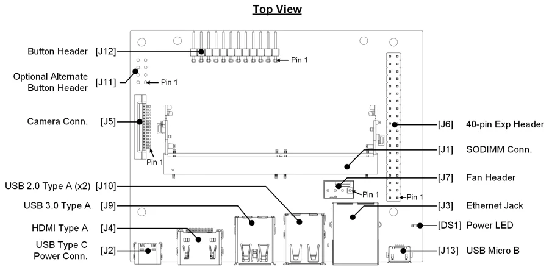

# Jetson Nano 2GB Developer Kit

**NVIDIA** · Other SBC

Revision: P3542 carrier; match manufacturer guide

Coverage: Supporting references collected; physical GPIO map still needed

[Browse all manufacturers](../../../../BROWSE.md) · [Devices & IoT](../../../../DEVICES.md) · [Open in the browser guide](https://valleytech-black-wire-guide.pages.dev/?board=nvidia-other-jetson-nano-2gb-developer-kit)

Architecture: **ARM**

## Datasheets and original documentation

Board datasheet: **not yet recorded**. Visual reference: **available**.

[Original manufacturer hardware website](https://developer.nvidia.com/embedded/learn/jetson-nano-2gb-devkit-user-guide)

- **hardware-guide / board**: [Nano 2GB hardware user guide](https://developer.nvidia.com/embedded/learn/jetson-nano-2gb-devkit-user-guide) · online

Match the exact board, carrier and PCB revision. A component datasheet does not define the board header or input-power limits.

[Documentation coverage and remaining gaps](../../../../DOCUMENTATION.md)

## Specifications and hardware documentation

- [Manufacturer specifications & hardware guide](https://developer.nvidia.com/embedded/learn/jetson-nano-2gb-devkit-user-guide)

## Nano 2GB P3542 carrier — connector locations

**board labeling image** · Reviewed source · PNG

[Open original reference](../../../../library/media/adb01069ac7b3aaee1de1a767dbbbbbe2b6671c46eee7625c22d10de72eaf542.png)

**Credit and rights:** NVIDIA / original reference contributors. Asset-specific redistribution and print rights have not been established. Original artwork is not relicensed by the Black Wire editorial license.. Source/manufacturer: NVIDIA.

[Source 1](https://d29g4g2dyqv443.cloudfront.net/sites/default/files/akamai/embedded/images/docs/jetson/641393088.png) · [Source 2](https://developer.nvidia.com/embedded/learn/jetson-nano-2gb-devkit-user-guide) · [Source 3](https://www.waveshare.com/wiki/Jetson_Nano_2GB_Developer_Kit)

Only the connectors and PCB revision shown are covered. Match physical orientation and electrical limits in the manufacturer hardware guide.

Image revision: P3542 carrier; match manufacturer guide

SHA-256: `adb01069ac7b3aaee1de1a767dbbbbbe2b6671c46eee7625c22d10de72eaf542`

Pin assignments have not been independently electrically verified. Check board revision before wiring.
