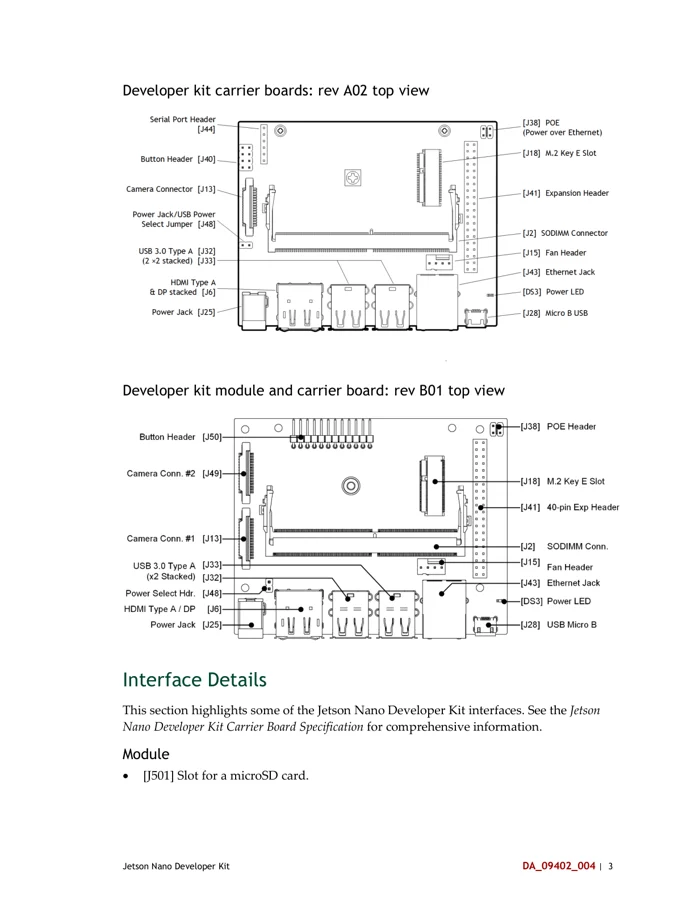

# Jetson Nano Developer Kit

**NVIDIA** · Other SBC

Revision: Carrier revision: match source; document version 1.3

Coverage: Supporting references collected; physical GPIO map still needed

[Browse all manufacturers](../../../../BROWSE.md) · [Devices & IoT](../../../../DEVICES.md) · [Open in the browser guide](https://valleytech-black-wire-guide.pages.dev/?board=nvidia-other-jetson-nano-developer-kit)

Architecture: **ARM**

## Datasheets and original documentation

Board datasheet: **not yet recorded**. Visual reference: **available**.

[Original manufacturer hardware website](https://developer.nvidia.com/embedded/learn/get-started-jetson-nano-devkit)

- **hardware-guide / board**: [Jetson Nano Developer Kit User Guide](https://developer.nvidia.com/embedded/dlc/Jetson_Nano_Developer_Kit_User_Guide) · [saved document](../../../../library/media/96e07c785c55969e35b0a69fc58fdea0542b2c3ce8f565a659240e53c6ce3f34.pdf)

Match the exact board, carrier and PCB revision. A component datasheet does not define the board header or input-power limits.

[Documentation coverage and remaining gaps](../../../../DOCUMENTATION.md)

## Specifications and hardware documentation

- [Manufacturer specifications & hardware guide](https://developer.nvidia.com/embedded/learn/get-started-jetson-nano-devkit)

## Jetson Nano Developer Kit User Guide

**original reference PDF** · Reviewed source · PDF

[Open original reference](../../../../library/media/96e07c785c55969e35b0a69fc58fdea0542b2c3ce8f565a659240e53c6ce3f34.pdf)

**Credit and rights:** NVIDIA / original reference contributors. Asset-specific redistribution and print rights have not been established. Original artwork is not relicensed by the Black Wire editorial license.. Source/manufacturer: NVIDIA.

[Source 1](https://developer.nvidia.com/embedded/dlc/Jetson_Nano_Developer_Kit_User_Guide) · [Source 2](https://developer.nvidia.com/embedded/learn/get-started-jetson-nano-devkit) · [Source 3](https://www.waveshare.com/wiki/Jetson_Nano_Developer_Kit)

Only the connectors and PCB revision shown are covered. Match physical orientation and electrical limits in the manufacturer hardware guide.

Image revision: Document version 1.3; match carrier PCB revision

SHA-256: `96e07c785c55969e35b0a69fc58fdea0542b2c3ce8f565a659240e53c6ce3f34`

## A02 and B01 carrier layouts — user guide p6

**board labeling image** · Reviewed source · PNG

[Open original reference](../../../../library/media/ce4c0be5bbc0228cdc46640060ecc5cb46214c03811f38672a6e584946de2555.png)

**Credit and rights:** NVIDIA / original reference contributors. Asset-specific redistribution and print rights have not been established. Original artwork is not relicensed by the Black Wire editorial license.. Source/manufacturer: NVIDIA.

[Source 1](https://developer.nvidia.com/embedded/dlc/Jetson_Nano_Developer_Kit_User_Guide) · [Source 2](https://developer.nvidia.com/embedded/learn/get-started-jetson-nano-devkit) · [Source 3](https://www.waveshare.com/wiki/Jetson_Nano_Developer_Kit)

Only the connectors and PCB revision shown are covered. Match physical orientation and electrical limits in the manufacturer hardware guide. Original PDF page rendered at 144 dpi; original PDF retained unchanged.

Image revision: Document version 1.3; match carrier PCB revision

SHA-256: `ce4c0be5bbc0228cdc46640060ecc5cb46214c03811f38672a6e584946de2555`

Pin assignments have not been independently electrically verified. Check board revision before wiring.
