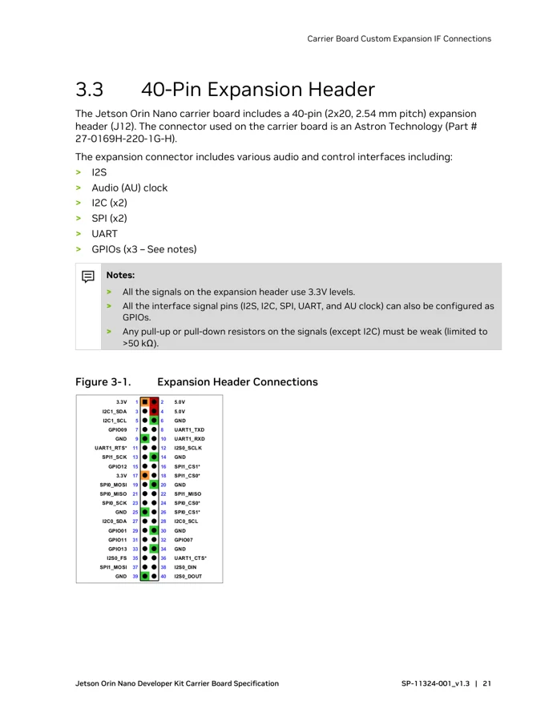
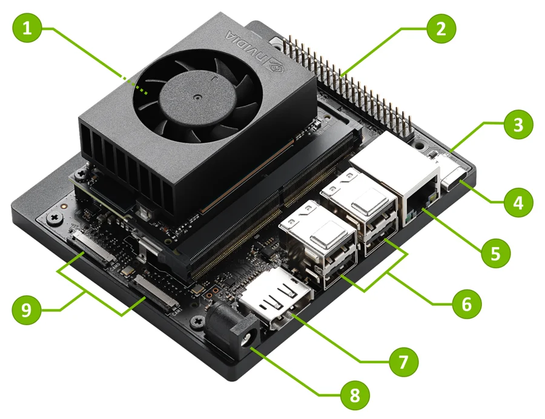

# Jetson Orin Nano Developer Kit

**NVIDIA** · Other SBC

Revision: Carrier revision: match source; document version 1.3

Coverage: Physical pinout source collected; check exact connector scope and revision

[Browse all manufacturers](../../../../BROWSE.md) · [Devices & IoT](../../../../DEVICES.md) · [Open in the browser guide](https://valleytech-black-wire-guide.pages.dev/?board=nvidia-other-jetson-orin-nano-developer-kit)

Architecture: **ARM**

## Datasheets and original documentation

Board datasheet: **recorded**. Visual reference: **available**.

[Original manufacturer hardware website](https://docs.nvidia.com/jetson/orin-nano-devkit/user-guide/hardware_layout.html)

- **datasheet / board**: [Jetson Orin Nano Developer Kit Carrier Board Specification](https://developer.nvidia.com/downloads/assets/embedded/secure/jetson/orin_nano/docs/jetson_orin_nano_devkit_carrier_board_specification_sp.pdf) · [saved document](../../../../library/media/4a0f7ba948bce4881e176f0f8636ef3dbd40e3df9dd33134e6a7433359d18c02.pdf)

Match the exact board, carrier and PCB revision. A component datasheet does not define the board header or input-power limits.

[Documentation coverage and remaining gaps](../../../../DOCUMENTATION.md)

## Specifications and hardware documentation

- [Manufacturer specifications & hardware guide](https://docs.nvidia.com/jetson/orin-nano-devkit/user-guide/hardware_layout.html)

## Jetson Orin Nano Developer Kit Carrier Board Specification

**original reference PDF** · Reviewed source · PDF

[Open original reference](../../../../library/media/4a0f7ba948bce4881e176f0f8636ef3dbd40e3df9dd33134e6a7433359d18c02.pdf)

**Credit and rights:** NVIDIA / original reference contributors. Asset-specific redistribution and print rights have not been established. Original artwork is not relicensed by the Black Wire editorial license.. Source/manufacturer: NVIDIA.

[Source 1](https://developer.nvidia.com/downloads/assets/embedded/secure/jetson/orin_nano/docs/jetson_orin_nano_devkit_carrier_board_specification_sp.pdf) · [Source 2](https://docs.nvidia.com/jetson/orin-nano-devkit/user-guide/hardware_layout.html) · [Source 3](https://www.waveshare.com/wiki/Jetson_Orin_Nano_Developer_Kit)

Only the connectors and PCB revision shown are covered. Match physical orientation and electrical limits in the manufacturer hardware guide.

Image revision: Document version 1.3; match carrier PCB revision

SHA-256: `4a0f7ba948bce4881e176f0f8636ef3dbd40e3df9dd33134e6a7433359d18c02`

## J12 40-pin expansion header — carrier specification p25

**pinout image** · Reviewed source · PNG

[Open original reference](../../../../library/media/cc51e208ac8ee9d41fe523eb2c88d518cc990569e06a932cf32d922df472c9c8.png)

**Credit and rights:** NVIDIA / original reference contributors. Asset-specific redistribution and print rights have not been established. Original artwork is not relicensed by the Black Wire editorial license.. Source/manufacturer: NVIDIA.

[Source 1](https://developer.nvidia.com/downloads/assets/embedded/secure/jetson/orin_nano/docs/jetson_orin_nano_devkit_carrier_board_specification_sp.pdf) · [Source 2](https://docs.nvidia.com/jetson/orin-nano-devkit/user-guide/hardware_layout.html) · [Source 3](https://www.waveshare.com/wiki/Jetson_Orin_Nano_Developer_Kit)

Only the connectors and PCB revision shown are covered. Match physical orientation and electrical limits in the manufacturer hardware guide. Original PDF page rendered at 144 dpi; original PDF retained unchanged.

Image revision: Document version 1.3; match carrier PCB revision

SHA-256: `cc51e208ac8ee9d41fe523eb2c88d518cc990569e06a932cf32d922df472c9c8`

## Manufacturer carrier / developer kit layout

**board labeling image** · Reviewed source · PNG

[Open original reference](../../../../library/media/a961cccb670e025ee1eb35cd01f9331e72d3ea1b6d5d57f69a52f2faf5318a50.png)

**Credit and rights:** NVIDIA / original reference contributors. Asset-specific redistribution and print rights have not been established. Original artwork is not relicensed by the Black Wire editorial license.. Source/manufacturer: NVIDIA.

[Source 1](https://docs.nvidia.com/jetson/orin-nano-devkit/user-guide/_images/jetson-orin-nano-qtr_numbered.png) · [Source 2](https://docs.nvidia.com/jetson/orin-nano-devkit/user-guide/hardware_layout.html) · [Source 3](https://www.waveshare.com/wiki/Jetson_Orin_Nano_Developer_Kit)

Only the connectors and PCB revision shown are covered. Match physical orientation and electrical limits in the manufacturer hardware guide.

Image revision: Document version 1.3; match carrier PCB revision

SHA-256: `a961cccb670e025ee1eb35cd01f9331e72d3ea1b6d5d57f69a52f2faf5318a50`

Pin assignments have not been independently electrically verified. Check board revision before wiring.
