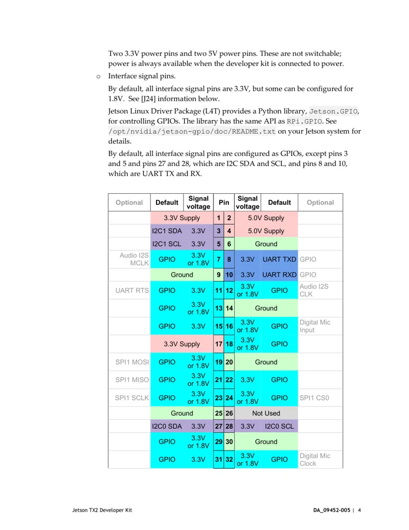
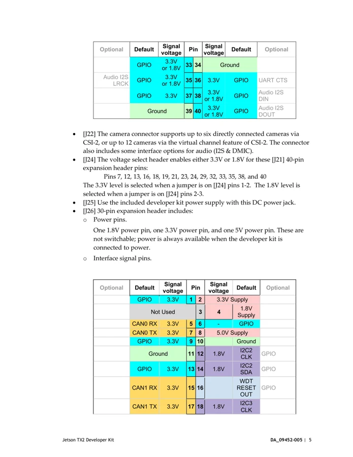
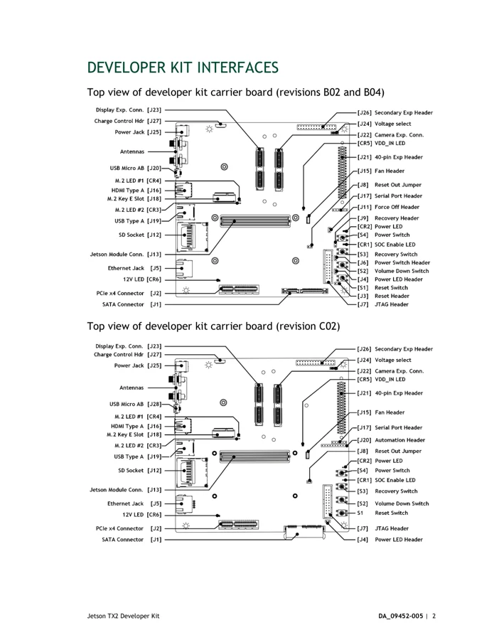

# Jetson TX2 Developer Kit

**NVIDIA** · Other SBC

Revision: Carrier revision: match source; document version 4.0

Coverage: Supporting references collected; physical GPIO map still needed

[Browse all manufacturers](../../../../BROWSE.md) · [Devices & IoT](../../../../DEVICES.md) · [Open in the browser guide](https://valleytech-black-wire-guide.pages.dev/?board=nvidia-jetson-tx2-developer-kit)

Architecture: **ARM**

## Datasheets and original documentation

Board datasheet: **not yet recorded**. Visual reference: **available**.

[Original manufacturer hardware website](https://developer.nvidia.com/embedded/downloads#?search=Jetson%20TX2%20Developer%20Kit%20User%20Guide)

- **hardware-guide / board**: [Jetson TX2 Developer Kit User Guide](https://developer.nvidia.com/embedded/dlc/jetson_tx2_developer_kit_user_guide) · [saved document](../../../../library/media/c058fc08e4d53dda8d5e68c42932c0d169488808fb4a158498057da1f956b059.pdf)

Match the exact board, carrier and PCB revision. A component datasheet does not define the board header or input-power limits.

[Documentation coverage and remaining gaps](../../../../DOCUMENTATION.md)

## Specifications and hardware documentation

- [Manufacturer specifications & hardware guide](https://developer.nvidia.com/embedded/downloads#?search=Jetson%20TX2%20Developer%20Kit%20User%20Guide)

## Jetson TX2 Developer Kit User Guide

**original reference PDF** · Reviewed source · PDF

[Open original reference](../../../../library/media/c058fc08e4d53dda8d5e68c42932c0d169488808fb4a158498057da1f956b059.pdf)

**Credit and rights:** NVIDIA / original reference contributors. Asset-specific redistribution and print rights have not been established. Original artwork is not relicensed by the Black Wire editorial license.. Source/manufacturer: NVIDIA.

[Source 1](https://developer.nvidia.com/embedded/dlc/jetson_tx2_developer_kit_user_guide) · [Source 2](https://developer.nvidia.com/embedded/downloads#?search=Jetson%20TX2%20Developer%20Kit%20User%20Guide)

Only the connectors and PCB revision shown are covered. Match physical orientation and electrical limits in the manufacturer hardware guide.

Image revision: Document version 4.0; match carrier PCB revision

SHA-256: `c058fc08e4d53dda8d5e68c42932c0d169488808fb4a158498057da1f956b059`

## J21 expansion header table — user guide p7; continues p8

**pin function reference** · Reviewed source · PNG

[Open original reference](../../../../library/media/404799d6e767676248384f35f5c7acedc5ca92f9607eb940a930f72828e4a302.png)

**Credit and rights:** NVIDIA / original reference contributors. Asset-specific redistribution and print rights have not been established. Original artwork is not relicensed by the Black Wire editorial license.. Source/manufacturer: NVIDIA.

[Source 1](https://developer.nvidia.com/embedded/dlc/jetson_tx2_developer_kit_user_guide) · [Source 2](https://developer.nvidia.com/embedded/downloads#?search=Jetson%20TX2%20Developer%20Kit%20User%20Guide)

Only the connectors and PCB revision shown are covered. Match physical orientation and electrical limits in the manufacturer hardware guide. Original PDF page rendered at 144 dpi; original PDF retained unchanged.

Image revision: Document version 4.0; match carrier PCB revision

SHA-256: `404799d6e767676248384f35f5c7acedc5ca92f9607eb940a930f72828e4a302`

## J21 table continuation and J24 voltage selection — user guide p8

**pin function reference** · Reviewed source · PNG

[Open original reference](../../../../library/media/49a7bb256276a673c54e883ec55bf89cf0cf151d0d1ebc529dffdb7ca271b6e6.png)

**Credit and rights:** NVIDIA / original reference contributors. Asset-specific redistribution and print rights have not been established. Original artwork is not relicensed by the Black Wire editorial license.. Source/manufacturer: NVIDIA.

[Source 1](https://developer.nvidia.com/embedded/dlc/jetson_tx2_developer_kit_user_guide) · [Source 2](https://developer.nvidia.com/embedded/downloads#?search=Jetson%20TX2%20Developer%20Kit%20User%20Guide)

Only the connectors and PCB revision shown are covered. Match physical orientation and electrical limits in the manufacturer hardware guide. Original PDF page rendered at 144 dpi; original PDF retained unchanged.

Image revision: Document version 4.0; match carrier PCB revision

SHA-256: `49a7bb256276a673c54e883ec55bf89cf0cf151d0d1ebc529dffdb7ca271b6e6`

## TX2 carrier layout — user guide p5

**board labeling image** · Reviewed source · PNG

[Open original reference](../../../../library/media/6286c01a64e8cd33e5d6665e7b5ddbfdb7e892a0e6125a0d90d7cb4d21eb89d0.png)

**Credit and rights:** NVIDIA / original reference contributors. Asset-specific redistribution and print rights have not been established. Original artwork is not relicensed by the Black Wire editorial license.. Source/manufacturer: NVIDIA.

[Source 1](https://developer.nvidia.com/embedded/dlc/jetson_tx2_developer_kit_user_guide) · [Source 2](https://developer.nvidia.com/embedded/downloads#?search=Jetson%20TX2%20Developer%20Kit%20User%20Guide)

Only the connectors and PCB revision shown are covered. Match physical orientation and electrical limits in the manufacturer hardware guide. Original PDF page rendered at 144 dpi; original PDF retained unchanged.

Image revision: Document version 4.0; match carrier PCB revision

SHA-256: `6286c01a64e8cd33e5d6665e7b5ddbfdb7e892a0e6125a0d90d7cb4d21eb89d0`

Pin assignments have not been independently electrically verified. Check board revision before wiring.
