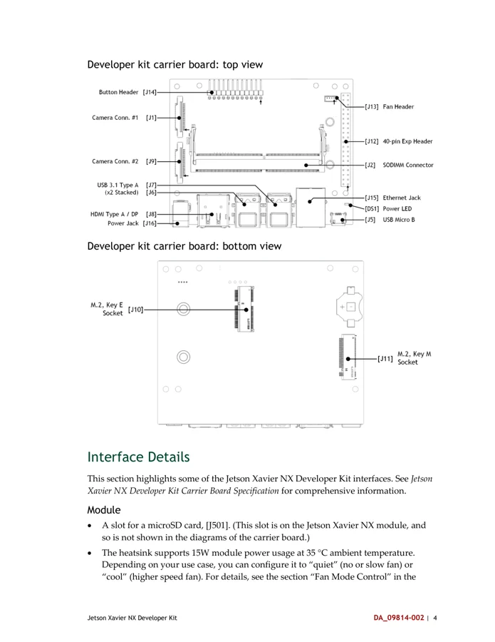

# Jetson Xavier NX Developer Kit

**NVIDIA** · Other SBC

Revision: See document version and carrier model

Coverage: Supporting references collected; physical GPIO map still needed

[Browse all manufacturers](../../../../BROWSE.md) · [Devices & IoT](../../../../DEVICES.md) · [Open in the browser guide](https://valleytech-black-wire-guide.pages.dev/?board=nvidia-other-jetson-xavier-nx-developer-kit)

Architecture: **ARM**

## Datasheets and original documentation

Board datasheet: **not yet recorded**. Visual reference: **available**.

[Original manufacturer hardware website](https://developer.nvidia.com/embedded/learn/get-started-jetson-xavier-nx-devkit)

- **hardware-guide / board**: [Jetson Xavier NX Developer Kit User Guide](https://developer.download.nvidia.com/embedded/L4T/r32_Release_v4.2/Jetson_Xavier_NX_Developer_Kit_User_Guide.pdf) · [saved document](../../../../library/media/a2bb6d5eeca2324f371dff46b198bb98625427fc5d7739acb9f11d1074537ea5.pdf)

Match the exact board, carrier and PCB revision. A component datasheet does not define the board header or input-power limits.

[Documentation coverage and remaining gaps](../../../../DOCUMENTATION.md)

## Specifications and hardware documentation

- [Manufacturer specifications & hardware guide](https://developer.nvidia.com/embedded/learn/get-started-jetson-xavier-nx-devkit)

## Jetson Xavier NX Developer Kit User Guide

**original reference PDF** · Reviewed source · PDF

[Open original reference](../../../../library/media/a2bb6d5eeca2324f371dff46b198bb98625427fc5d7739acb9f11d1074537ea5.pdf)

**Credit and rights:** NVIDIA / original reference contributors. Asset-specific redistribution and print rights have not been established. Original artwork is not relicensed by the Black Wire editorial license.. Source/manufacturer: NVIDIA.

[Source 1](https://developer.download.nvidia.com/embedded/L4T/r32_Release_v4.2/Jetson_Xavier_NX_Developer_Kit_User_Guide.pdf) · [Source 2](https://developer.nvidia.com/embedded/learn/getting-started-jetson) · [Source 3](https://developer.nvidia.com/embedded/learn/get-started-jetson-xavier-nx-devkit) · [Source 4](https://www.waveshare.com/wiki/Jetson_Xavier_NX_Developer_Kit)

Only the connectors and PCB revision shown are covered. Match physical orientation and electrical limits in the manufacturer hardware guide.

Image revision: See document version and carrier model

SHA-256: `a2bb6d5eeca2324f371dff46b198bb98625427fc5d7739acb9f11d1074537ea5`

## Carrier top and bottom connector locations — user guide p7

**board labeling image** · Reviewed source · PNG

[Open original reference](../../../../library/media/6596c1ae866662a60597005e1eea2853e9b002938d51066c35af5739d68c5824.png)

**Credit and rights:** NVIDIA / original reference contributors. Asset-specific redistribution and print rights have not been established. Original artwork is not relicensed by the Black Wire editorial license.. Source/manufacturer: NVIDIA.

[Source 1](https://developer.download.nvidia.com/embedded/L4T/r32_Release_v4.2/Jetson_Xavier_NX_Developer_Kit_User_Guide.pdf) · [Source 2](https://developer.nvidia.com/embedded/learn/getting-started-jetson) · [Source 3](https://developer.nvidia.com/embedded/learn/get-started-jetson-xavier-nx-devkit) · [Source 4](https://www.waveshare.com/wiki/Jetson_Xavier_NX_Developer_Kit)

Only the connectors and PCB revision shown are covered. Match physical orientation and electrical limits in the manufacturer hardware guide. Original PDF page rendered at 144 dpi; original PDF retained unchanged.

Image revision: See document version and carrier model

SHA-256: `6596c1ae866662a60597005e1eea2853e9b002938d51066c35af5739d68c5824`

Pin assignments have not been independently electrically verified. Check board revision before wiring.
