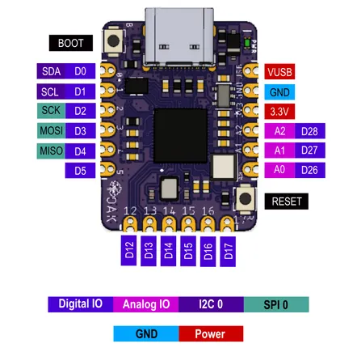

# CAST-AWAY RP2040

**Oak Development Technologies** · RP2040

Revision: Not identified  
Coverage: Pinout image collected

[Browse all manufacturers](../../../../BROWSE.md) · [Desktop app](https://github.com/valleytechsolutions/black-wire-desktop)

## Physical board pinout

**pinout image** · Reviewed source · PNG

[Open original reference](../../../../library/media/c646ff75a6e125ea4bf67cab8960e71dd54c35301acaabc05a87201f4dbabd95.png)

**Credit and rights:** Not established; source attribution retained. Source/manufacturer: Oak Development Technologies.

[Source 1](https://raw.githubusercontent.com/skerr92/odt-dev-boards/master/boards/Cast-Away-RP2040/Screen%20Shot%202021-11-21%20at%202.10.17%20PM.png) · [Source 2](https://www.tindie.com/products/oakdevtech/cast-away-rp2040-a-castellated-rp2040-dev-board/)

Discovered from CircuitPython board metadata and the linked product/documentation page. Exact hardware revision requires matching to the diagram.

SHA-256: `c646ff75a6e125ea4bf67cab8960e71dd54c35301acaabc05a87201f4dbabd95`

Pin assignments have not been independently electrically verified. Check board revision before wiring.
