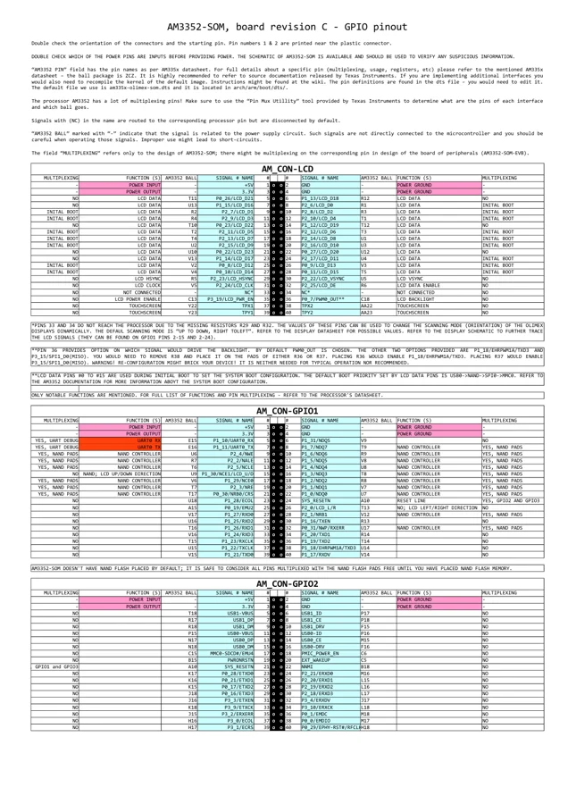
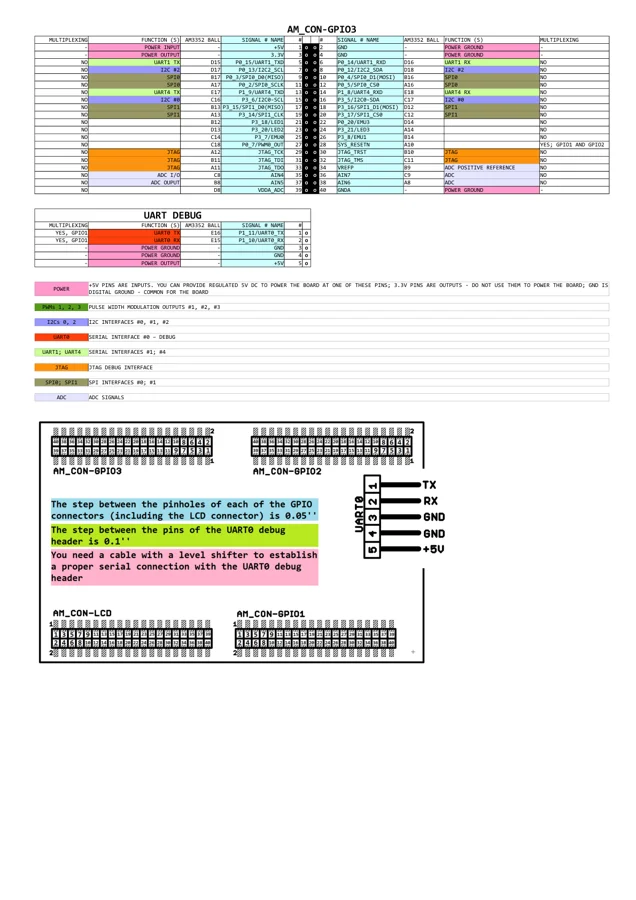

# AM3352-SOM

**Olimex** · AM3352

Revision: C (GPIO reference)

Coverage: Physical pinout source collected; check exact connector scope and revision

[Browse all manufacturers](../../../../BROWSE.md) · [Devices & IoT](../../../../DEVICES.md) · [Open in the browser guide](https://valleytech-black-wire-guide.pages.dev/?board=olimex-am3352-som)

## Datasheets and original documentation

Board datasheet: **not yet recorded**. Visual reference: **available**.

[Original manufacturer hardware website](https://www.olimex.com/Products/SOM/AM335X/AM3352-SOM/)

- **connector-reference / board**: [AM3352-SOM revision C GPIO reference](https://www.olimex.com/Products/SOM/AM335X/AM3352-SOM/resources/AM3352_SOM_GPIOs.pdf) · [saved document](../../../../library/media/2ddc138a8cff1389b5f6151399cb03b55adfcf0a0a17965cb266f19eb7bd2907.pdf)
- **hardware-guide / board**: [Board user manual](https://www.olimex.com/Products/SOM/AM335X/AM3352-SOM/resources/AM3352-SOM-UM.pdf) · online

Match the exact board, carrier and PCB revision. A component datasheet does not define the board header or input-power limits.

[Documentation coverage and remaining gaps](../../../../DOCUMENTATION.md)

## Specifications and hardware documentation

- [Manufacturer specifications & hardware guide](https://www.olimex.com/Products/SOM/AM335X/AM3352-SOM/)

## AM3352-SOM revision C GPIO reference

**original reference PDF** · Reviewed source · PDF

[Open original reference](../../../../library/media/2ddc138a8cff1389b5f6151399cb03b55adfcf0a0a17965cb266f19eb7bd2907.pdf)

**Credit and rights:** Olimex / original reference contributors. Asset-specific redistribution and print rights have not been established. Original artwork is not relicensed by the Black Wire editorial license.. Source/manufacturer: Olimex.

[Source 1](https://www.olimex.com/Products/SOM/AM335X/AM3352-SOM/resources/AM3352_SOM_GPIOs.pdf) · [Source 2](https://www.olimex.com/Products/SOM/AM335X/AM3352-SOM/)

Only the connectors and PCB revision shown are covered. Match physical orientation and electrical limits in the manufacturer hardware guide.

Image revision: C (GPIO reference)

SHA-256: `2ddc138a8cff1389b5f6151399cb03b55adfcf0a0a17965cb266f19eb7bd2907`

## Revision C physical GPIO connectors — page 1

**pinout image** · Reviewed source · PNG

[Open original reference](../../../../library/media/cd0c65e3da9e51e1d539c1a7167fbaad830f84d2cb87eecc9b0b77097b1f0ba4.png)

**Credit and rights:** Olimex / original reference contributors. Asset-specific redistribution and print rights have not been established. Original artwork is not relicensed by the Black Wire editorial license.. Source/manufacturer: Olimex.

[Source 1](https://www.olimex.com/Products/SOM/AM335X/AM3352-SOM/resources/AM3352_SOM_GPIOs.pdf) · [Source 2](https://www.olimex.com/Products/SOM/AM335X/AM3352-SOM/)

Only the connectors and PCB revision shown are covered. Match physical orientation and electrical limits in the manufacturer hardware guide. Original PDF page rendered at 144 dpi; original PDF retained unchanged.

Image revision: C (GPIO reference)

SHA-256: `cd0c65e3da9e51e1d539c1a7167fbaad830f84d2cb87eecc9b0b77097b1f0ba4`

## Revision C connector orientation and GPIO3 — page 2

**pinout image** · Reviewed source · PNG

[Open original reference](../../../../library/media/25c7f1525ca6192ffc25620fe2bccaf37f5b2446f76993730bd39c45a995c39a.png)

**Credit and rights:** Olimex / original reference contributors. Asset-specific redistribution and print rights have not been established. Original artwork is not relicensed by the Black Wire editorial license.. Source/manufacturer: Olimex.

[Source 1](https://www.olimex.com/Products/SOM/AM335X/AM3352-SOM/resources/AM3352_SOM_GPIOs.pdf) · [Source 2](https://www.olimex.com/Products/SOM/AM335X/AM3352-SOM/)

Only the connectors and PCB revision shown are covered. Match physical orientation and electrical limits in the manufacturer hardware guide. Original PDF page rendered at 144 dpi; original PDF retained unchanged.

Image revision: C (GPIO reference)

SHA-256: `25c7f1525ca6192ffc25620fe2bccaf37f5b2446f76993730bd39c45a995c39a`

Pin assignments have not been independently electrically verified. Check board revision before wiring.
