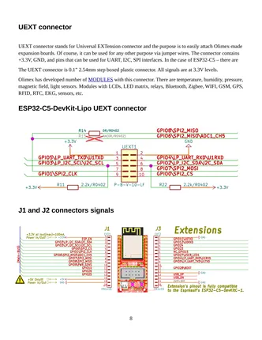
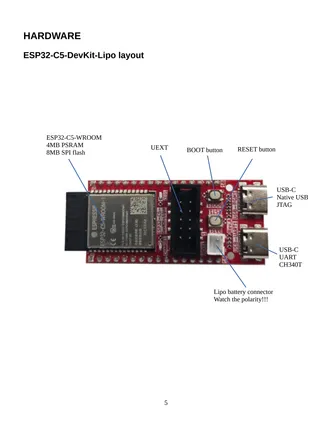

# ESP32-C5-DevKit-Lipo

**Olimex** · ESP32-C5

Revision: Not identified

Coverage: Pinout image collected

[Browse all manufacturers](../../../../BROWSE.md) · [Devices & IoT](../../../../DEVICES.md) · [Open in the browser guide](https://valleytech-black-wire-guide.pages.dev/?board=olimex-esp32-esp32-c5-devkit-lipo)

## Datasheets and original documentation

Board datasheet: **not yet recorded**. Visual reference: **available**.

[Manufacturer source (recorded link)](https://www.olimex.com/Products/IoT/ESP32-C5/ESP32-C5-DevKit-Lipo/open-source-hardware)

A chip datasheet, schematic and board datasheet have different scopes. Match the exact hardware revision.

[Documentation coverage and remaining gaps](../../../../DOCUMENTATION.md)

## Board and connector pinout reference

**pinout image** · Reviewed source · PNG

[Open original reference](../../../../library/media/f8b8bb0e97f52df2e16bbcb56bef247561c48f45dd10c37f614b57dc8170c15b.png)

**Credit and rights:** Not established; source attribution retained. Source/manufacturer: Olimex.

[Source 1](https://raw.githubusercontent.com/OLIMEX/ESP32-C5-DevKit-Lipo/main/DOCUMENTS/ESP32-C5-DevKit-Lipo-user-manual.pdf) · [Source 2](https://www.olimex.com/Products/IoT/ESP32-C5/ESP32-C5-DevKit-Lipo/open-source-hardware)

Image revision: Not identified

SHA-256: `f8b8bb0e97f52df2e16bbcb56bef247561c48f45dd10c37f614b57dc8170c15b`

## Board component locations

**board labeling image** · Reviewed source · PNG

[Open original reference](../../../../library/media/d4f2ed9bd64e088dc05bf138f4f636c7fc0108b0bac4ec2fff95f3bc3cac5207.png)

**Credit and rights:** Not established; source attribution retained. Source/manufacturer: Olimex.

[Source 1](https://raw.githubusercontent.com/OLIMEX/ESP32-C5-DevKit-Lipo/main/DOCUMENTS/ESP32-C5-DevKit-Lipo-user-manual.pdf) · [Source 2](https://www.olimex.com/Products/IoT/ESP32-C5/ESP32-C5-DevKit-Lipo/open-source-hardware)

Image revision: Not identified

SHA-256: `d4f2ed9bd64e088dc05bf138f4f636c7fc0108b0bac4ec2fff95f3bc3cac5207`

## Original board user manual

**original reference PDF** · Reviewed source · PDF

[Open original reference](../../../../library/media/44141acab94ca9e8b646dee07a0afeb4c8caee0c28aac1455a77f7c3dd18c231.pdf)

**Credit and rights:** Not established; source attribution retained. Source/manufacturer: Olimex.

[Source 1](https://raw.githubusercontent.com/OLIMEX/ESP32-C5-DevKit-Lipo/main/DOCUMENTS/ESP32-C5-DevKit-Lipo-user-manual.pdf) · [Source 2](https://www.olimex.com/Products/IoT/ESP32-C5/ESP32-C5-DevKit-Lipo/open-source-hardware)

Image revision: Not identified

SHA-256: `44141acab94ca9e8b646dee07a0afeb4c8caee0c28aac1455a77f7c3dd18c231`

Pin assignments have not been independently electrically verified. Check board revision before wiring.
