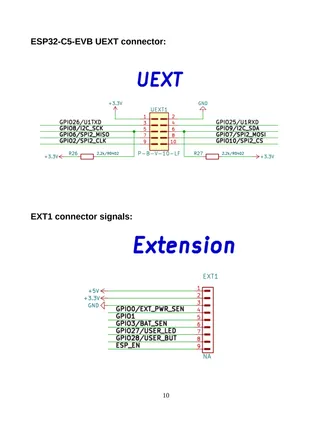
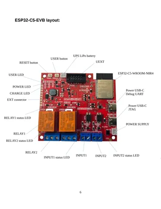

# ESP32-C5-EVB

**Olimex** · ESP32-C5

Revision: Not identified  
Coverage: Pinout image collected

[Browse all manufacturers](../../../../BROWSE.md) · [Desktop app](https://github.com/valleytechsolutions/black-wire-desktop)

## Board and connector pinout reference

**pinout image** · Reviewed source · PNG

[Open original reference](../../../../library/media/52c2eebe280431a50a5c641f01cea7f9c6fcea75cd364b150383a7f105096f4e.png)

**Credit and rights:** Not established; source attribution retained. Source/manufacturer: Olimex.

[Source 1](https://raw.githubusercontent.com/OLIMEX/ESP32-C5-EVB/main/DOCUMENTS/ESP32-C5-EVB-user-manual.pdf) · [Source 2](https://www.olimex.com/Products/IoT/ESP32-C5/ESP32-C5-EVB/open-source-hardware)

SHA-256: `52c2eebe280431a50a5c641f01cea7f9c6fcea75cd364b150383a7f105096f4e`

## Board component locations

**board labeling image** · Reviewed source · PNG

[Open original reference](../../../../library/media/4ddd712d82f621f82e1fca4e212b27203375a07833254ccef2f2999ead4610f5.png)

**Credit and rights:** Not established; source attribution retained. Source/manufacturer: Olimex.

[Source 1](https://raw.githubusercontent.com/OLIMEX/ESP32-C5-EVB/main/DOCUMENTS/ESP32-C5-EVB-user-manual.pdf) · [Source 2](https://www.olimex.com/Products/IoT/ESP32-C5/ESP32-C5-EVB/open-source-hardware)

SHA-256: `4ddd712d82f621f82e1fca4e212b27203375a07833254ccef2f2999ead4610f5`

## Original board user manual

**original reference PDF** · Reviewed source · PDF

[Open original reference](../../../../library/media/60c8fdd97b7e4f252e73805b8542baf9a3668df53e717e28bb32966f41995a31.pdf)

**Credit and rights:** Not established; source attribution retained. Source/manufacturer: Olimex.

[Source 1](https://raw.githubusercontent.com/OLIMEX/ESP32-C5-EVB/main/DOCUMENTS/ESP32-C5-EVB-user-manual.pdf) · [Source 2](https://www.olimex.com/Products/IoT/ESP32-C5/ESP32-C5-EVB/open-source-hardware)

SHA-256: `60c8fdd97b7e4f252e73805b8542baf9a3668df53e717e28bb32966f41995a31`

Pin assignments have not been independently electrically verified. Check board revision before wiring.
