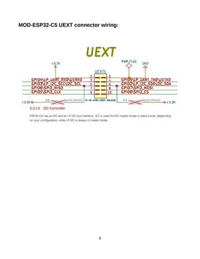

# MOD-ESP32-C5

**Olimex** · ESP32-C5

Revision: Not identified  
Coverage: Pinout image collected

[Browse all manufacturers](../../../../BROWSE.md) · [Desktop app](https://github.com/valleytechsolutions/black-wire-desktop)

## Board and connector pinout reference

**pinout image** · Reviewed source · PNG

[Open original reference](../../../../library/media/e69dbe5824364701ec083194ebef3e5ab297cf4b94b716a6d03fb04c362b0a55.png)

**Credit and rights:** Not established; source attribution retained. Source/manufacturer: Olimex.

[Source 1](https://raw.githubusercontent.com/OLIMEX/MOD-ESP32-C5/main/DOCUMENTS/MOD-ESP32-C5-user-manual.pdf) · [Source 2](https://www.olimex.com/Products/IoT/ESP32-C5/MOD-ESP32-C5/open-source-hardware)

SHA-256: `e69dbe5824364701ec083194ebef3e5ab297cf4b94b716a6d03fb04c362b0a55`

## Original board user manual

**original reference PDF** · Reviewed source · PDF

[Open original reference](../../../../library/media/3b4f8a0ef4b047df73e3d9a5a32dcec2716ebeb69359eedf9ecd00e5183aafcd.pdf)

**Credit and rights:** Not established; source attribution retained. Source/manufacturer: Olimex.

[Source 1](https://raw.githubusercontent.com/OLIMEX/MOD-ESP32-C5/main/DOCUMENTS/MOD-ESP32-C5-user-manual.pdf) · [Source 2](https://www.olimex.com/Products/IoT/ESP32-C5/MOD-ESP32-C5/open-source-hardware)

SHA-256: `3b4f8a0ef4b047df73e3d9a5a32dcec2716ebeb69359eedf9ecd00e5183aafcd`

Pin assignments have not been independently electrically verified. Check board revision before wiring.
