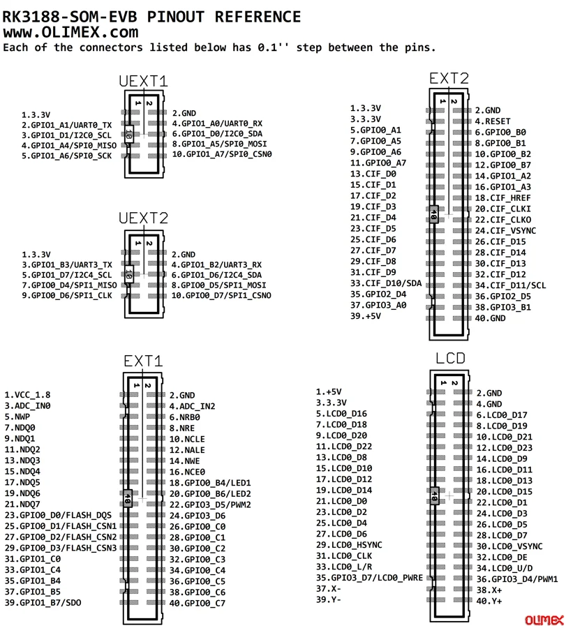

# RK3188-SOM-EVB

**Olimex** · Expansion

Revision: See exact source revision

Coverage: Physical pinout source collected; check exact connector scope and revision

[Browse all manufacturers](../../../../BROWSE.md) · [Devices & IoT](../../../../DEVICES.md) · [Open in the browser guide](https://valleytech-black-wire-guide.pages.dev/?board=olimex-rk3188-som-evb)

## Datasheets and original documentation

Board datasheet: **not yet recorded**. Visual reference: **available**.

[Original manufacturer hardware website](https://www.olimex.com/Products/SOM/RK3188/RK3188-SOM-EVB/)

- **hardware-guide / board**: [Board user manual](https://www.olimex.com/Products/SOM/RK3188/RK3188-SOM-EVB/resources/RK3188-SOM-EVB-UM.pdf) · online

Match the exact board, carrier and PCB revision. A component datasheet does not define the board header or input-power limits.

[Documentation coverage and remaining gaps](../../../../DOCUMENTATION.md)

## Specifications and hardware documentation

- [Manufacturer specifications & hardware guide](https://www.olimex.com/Products/SOM/RK3188/RK3188-SOM-EVB/)

## RK3188-SOM-EVB physical GPIO connector maps

**pinout image** · Reviewed source · PNG

[Open original reference](../../../../library/media/70d239a8168985802f9a8a1fa620ef6182fa6c1d6f02950e81327d2793937ed0.png)

**Credit and rights:** Olimex / original reference contributors. Asset-specific redistribution and print rights have not been established. Original artwork is not relicensed by the Black Wire editorial license.. Source/manufacturer: Olimex.

[Source 1](https://www.olimex.com/Products/SOM/RK3188/RK3188-SOM-EVB/resources/rk3188-som-evb-gpio.png) · [Source 2](https://www.olimex.com/Products/SOM/RK3188/RK3188-SOM-EVB/)

Only the connectors and PCB revision shown are covered. Match physical orientation and electrical limits in the manufacturer hardware guide.

Image revision: See exact source revision

SHA-256: `70d239a8168985802f9a8a1fa620ef6182fa6c1d6f02950e81327d2793937ed0`

Pin assignments have not been independently electrically verified. Check board revision before wiring.
