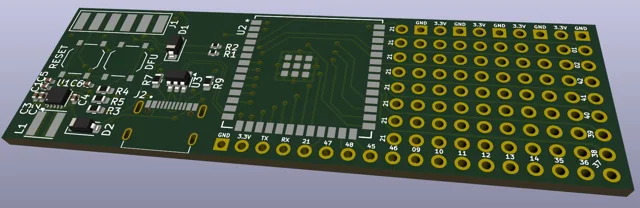
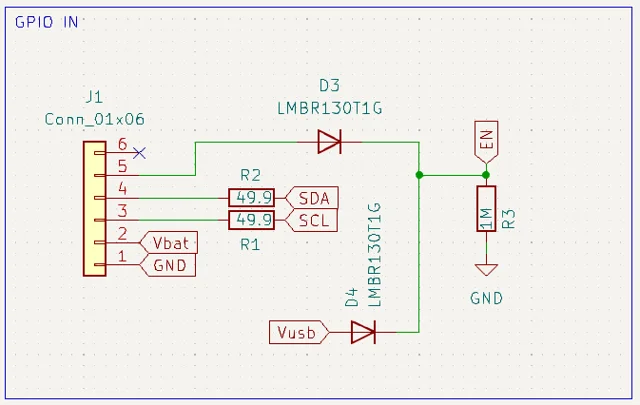
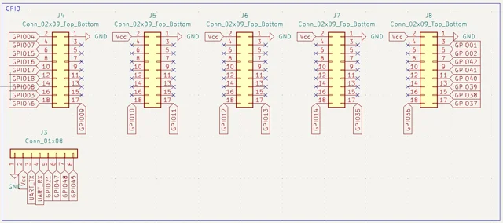
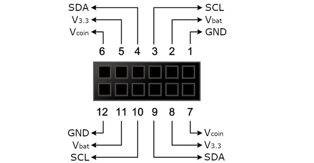

# ESP32-MDK PortaPack external module developer kit

**OpenSourceSDRLab** · ESP32-S3

Revision: Source PCB label V0.2

Coverage: Supporting references; complete physical pinout still needed

[Browse all manufacturers](../../../../BROWSE.md) · [Devices & IoT](../../../../DEVICES.md) · [Open in the browser guide](https://valleytech-black-wire-guide.pages.dev/?board=opensourcesdrlab-esp32-mdk)

## Datasheets and original documentation

Board datasheet: **not yet recorded**. Visual reference: **available**.

[Original manufacturer / project documentation](https://github.com/portapack-mayhem/mayhem-mdk)

- **product-page / board**: [ESP32-MDK original product](https://opensourcesdrlab.com/products/esp32-mdk) · online

Source identity and visual scope reviewed. Pin assignments and electrical limits are not independently bench-verified. Match the exact PCB revision, connector view and populated options. The 12-pin diagram is the host H4M connector shown in the MDK project, not an all-pad ESP32-MDK pinout or a verified H4M Pro connector map. MDK GPIO in/out schematics and PCB labels identify the expansion separately.

[Documentation coverage and remaining gaps](../../../../DOCUMENTATION.md)

## ESP32-MDK — PCB and visible labels

**board labeling image** · Source visual inspected; independent electrical and all-pin completeness review pending · JPG

[Open original reference](../../../../library/media/520f15c98ad073c67a03fff40103db527498acb9c1f5736875e051fb0b1275e7.jpg)

**Credit and rights:** OpenSourceSDRLab / original artwork contributors. Asset-specific redistribution and print rights are not established; Black Wire licenses do not relicense this source artwork.. Source/manufacturer: OpenSourceSDRLab.

[Source 1](https://github.com/portapack-mayhem/mayhem-mdk/raw/main/docs/pcb.jpg) · [Source 2](https://github.com/portapack-mayhem/mayhem-mdk)

Source identity and visual scope reviewed. Pin assignments and electrical limits are not independently bench-verified. Match the exact PCB revision, connector view and populated options. The 12-pin diagram is the host H4M connector shown in the MDK project, not an all-pad ESP32-MDK pinout or a verified H4M Pro connector map. MDK GPIO in/out schematics and PCB labels identify the expansion separately.

Image revision: Source PCB label V0.2

SHA-256: `520f15c98ad073c67a03fff40103db527498acb9c1f5736875e051fb0b1275e7`

## ESP32-MDK — host input schematic

**schematic image** · Source visual inspected; independent electrical and all-pin completeness review pending · PNG

[Open original reference](../../../../library/media/fc56a4a854ded9ff4031908d75901ec52f7b0e302893d2a2c3f75ea633e7dfaf.png)

**Credit and rights:** OpenSourceSDRLab / original artwork contributors. Asset-specific redistribution and print rights are not established; Black Wire licenses do not relicense this source artwork.. Source/manufacturer: OpenSourceSDRLab.

[Source 1](https://github.com/portapack-mayhem/mayhem-mdk/raw/main/docs/gpioin.png) · [Source 2](https://github.com/portapack-mayhem/mayhem-mdk)

Source identity and visual scope reviewed. Pin assignments and electrical limits are not independently bench-verified. Match the exact PCB revision, connector view and populated options. The 12-pin diagram is the host H4M connector shown in the MDK project, not an all-pad ESP32-MDK pinout or a verified H4M Pro connector map. MDK GPIO in/out schematics and PCB labels identify the expansion separately.

Image revision: Source PCB label V0.2

SHA-256: `fc56a4a854ded9ff4031908d75901ec52f7b0e302893d2a2c3f75ea633e7dfaf`

## ESP32-MDK — GPIO output headers schematic

**schematic image** · Source visual inspected; independent electrical and all-pin completeness review pending · PNG

[Open original reference](../../../../library/media/52071088f2a469533cb6da20321c1d1b7811b1815bc94e3b461a384741885bc4.png)

**Credit and rights:** OpenSourceSDRLab / original artwork contributors. Asset-specific redistribution and print rights are not established; Black Wire licenses do not relicense this source artwork.. Source/manufacturer: OpenSourceSDRLab.

[Source 1](https://github.com/portapack-mayhem/mayhem-mdk/raw/main/docs/gpioout.png) · [Source 2](https://github.com/portapack-mayhem/mayhem-mdk)

Source identity and visual scope reviewed. Pin assignments and electrical limits are not independently bench-verified. Match the exact PCB revision, connector view and populated options. The 12-pin diagram is the host H4M connector shown in the MDK project, not an all-pad ESP32-MDK pinout or a verified H4M Pro connector map. MDK GPIO in/out schematics and PCB labels identify the expansion separately.

Image revision: Source PCB label V0.2

SHA-256: `52071088f2a469533cb6da20321c1d1b7811b1815bc94e3b461a384741885bc4`

## ESP32-MDK — host H4M connector reference (not H4M Pro validation)

**connector reference** · Source visual inspected; independent electrical and all-pin completeness review pending · PNG

[Open original reference](../../../../library/media/8c34d345dccc75accb6c697eda8fb5e7f9b831ac90261f9a26654e06fc999134.png)

**Credit and rights:** OpenSourceSDRLab / original artwork contributors. Asset-specific redistribution and print rights are not established; Black Wire licenses do not relicense this source artwork.. Source/manufacturer: OpenSourceSDRLab.

[Source 1](https://github.com/portapack-mayhem/mayhem-mdk/raw/main/docs/H4MPinout.png) · [Source 2](https://github.com/portapack-mayhem/mayhem-mdk)

Source identity and visual scope reviewed. Pin assignments and electrical limits are not independently bench-verified. Match the exact PCB revision, connector view and populated options. The 12-pin diagram is the host H4M connector shown in the MDK project, not an all-pad ESP32-MDK pinout or a verified H4M Pro connector map. MDK GPIO in/out schematics and PCB labels identify the expansion separately.

Image revision: Source PCB label V0.2

SHA-256: `8c34d345dccc75accb6c697eda8fb5e7f9b831ac90261f9a26654e06fc999134`

Pin assignments have not been independently electrically verified. Check board revision before wiring.
