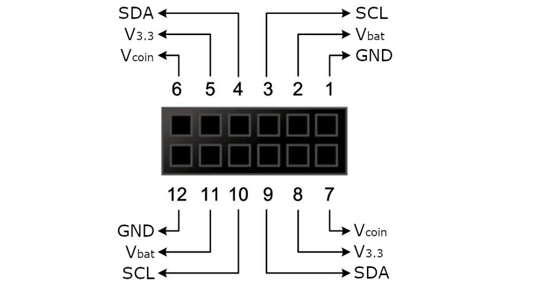

# PortaPack H4M

**OpenSourceSDRLab** · GPIO device

Revision: Not identified

Coverage: Physical pinout source collected; scope and revision require confirmation

[Browse all manufacturers](../../../../BROWSE.md) · [Devices & IoT](../../../../DEVICES.md) · [Open in the browser guide](https://valleytech-black-wire-guide.pages.dev/?board=opensourcesdrlab-portapack-h4m)

Device category: **Handhelds & pocket tools**

12-pin external expansion connector only. This does not map every internal HackRF or PortaPack contact.

## Specifications and hardware documentation

- [Mayhem H4M expansion documentation](https://github.com/portapack-mayhem/mayhem-mdk)

## H4M external 12-pin GPIO connector

**pinout image** · Reviewed source · PNG

[Open original reference](../../../../library/media/8c34d345dccc75accb6c697eda8fb5e7f9b831ac90261f9a26654e06fc999134.png)

**Credit and rights:** PortaPack Mayhem project / Mayhem MDK documentation contributors. Artwork rights not established; original source attribution retained.. Source/manufacturer: OpenSourceSDRLab.

[Source 1](https://raw.githubusercontent.com/portapack-mayhem/mayhem-mdk/c0c3d7f75790d5ac829c8d751840500f28994439/docs/H4MPinout.png) · [Source 2](https://github.com/portapack-mayhem/mayhem-mdk) · [Source 3](https://github.com/portapack-mayhem/mayhem-mdk/tree/c0c3d7f75790d5ac829c8d751840500f28994439)

Original publisher reference. Exact board/revision and electrical limits still require confirmation. 12-pin external expansion connector only. This does not map every internal HackRF or PortaPack contact.

Image revision: Not identified

SHA-256: `8c34d345dccc75accb6c697eda8fb5e7f9b831ac90261f9a26654e06fc999134`

Pin assignments have not been independently electrically verified. Check board revision before wiring.
