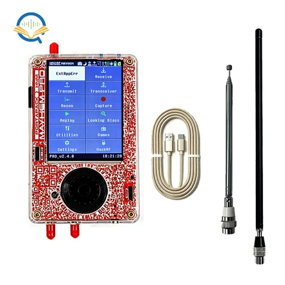

# PortaPack H4M Pro

**OpenSourceSDRLab** · HackRF Pro / H4M Pro

Revision: H4 Pro R1 source design

Coverage: Supporting references; complete physical pinout still needed

[Browse all manufacturers](../../../../BROWSE.md) · [Devices & IoT](../../../../DEVICES.md) · [Open in the browser guide](https://valleytech-black-wire-guide.pages.dev/?board=opensourcesdrlab-portapack-h4m-pro)

Device category: **Radios & GNSS**

Source identity and visual scope reviewed. Pin assignments and electrical limits are not independently bench-verified. Match the exact PCB revision, connector view and populated options. H4M Pro source schematics are available; complete physical GPIO map still needed. Older H4M pinouts are not asserted to apply to this revision.

## Datasheets and original documentation

Board datasheet: **not yet recorded**. Visual reference: **available**.

[Original manufacturer / project documentation](https://opensourcesdrlab.com/products/hackrf-pro-h4m-pro)

- **schematic / board**: [H4M Pro — Audio Schematic.pdf](https://raw.githubusercontent.com/portapack-mayhem/mayhem-firmware/d3e92b2e80425e3c0690f0523a3f3e5cc54569a0/hardware/portapack_h4m%20Pro/h4%20Pro-Schematic/Audio_Schematic.pdf) · [saved document](../../../../library/media/e78f1c31e28151f4ec3f19806f2947bfafae6e7a62ba8e1a8303c71ac8b4820b.pdf)
- **schematic / board**: [H4M Pro — CPLD Schematic.pdf](https://raw.githubusercontent.com/portapack-mayhem/mayhem-firmware/d3e92b2e80425e3c0690f0523a3f3e5cc54569a0/hardware/portapack_h4m%20Pro/h4%20Pro-Schematic/CPLD_Schematic.pdf) · [saved document](../../../../library/media/57ae71d6501fb655f17e5055d51db46bf5bc498c8bd1b21ba11f0b2ade00c577.pdf)
- **schematic / board**: [H4M Pro — LCD TF Schematic.pdf](https://raw.githubusercontent.com/portapack-mayhem/mayhem-firmware/d3e92b2e80425e3c0690f0523a3f3e5cc54569a0/hardware/portapack_h4m%20Pro/h4%20Pro-Schematic/LCD_TF_Schematic.pdf) · [saved document](../../../../library/media/f52f64af853878c7bdb1e5b2494c8e7945ff9ed7a0ecf8f5dda802ebd000d9ab.pdf)
- **schematic / board**: [H4M Pro — Power Switch Schematic.pdf](https://raw.githubusercontent.com/portapack-mayhem/mayhem-firmware/d3e92b2e80425e3c0690f0523a3f3e5cc54569a0/hardware/portapack_h4m%20Pro/h4%20Pro-Schematic/Power_Switch_Schematic.pdf) · [saved document](../../../../library/media/be1e8e581c0d73868922d7437e5bdac4e41ef297bc6ce612053e1f92f69baf41.pdf)
- **schematic / board**: [H4M Pro — To HackRF Connector Schematic.pdf](https://raw.githubusercontent.com/portapack-mayhem/mayhem-firmware/d3e92b2e80425e3c0690f0523a3f3e5cc54569a0/hardware/portapack_h4m%20Pro/h4%20Pro-Schematic/To_HackRF_Connector_Schematic.pdf) · [saved document](../../../../library/media/9c3641c0fdab8fcc238394fcdc49c9a2259d837f6971927416b8bbca74e613ef.pdf)
- **hardware-guide / board**: [Original H4M Pro hardware design](https://github.com/portapack-mayhem/mayhem-firmware/tree/next/hardware/portapack_h4m%20Pro) · online

Source identity and visual scope reviewed. Pin assignments and electrical limits are not independently bench-verified. Match the exact PCB revision, connector view and populated options. H4M Pro source schematics are available; complete physical GPIO map still needed. Older H4M pinouts are not asserted to apply to this revision.

[Documentation coverage and remaining gaps](../../../../DOCUMENTATION.md)

## H4M Pro — Audio Schematic.pdf

**original reference PDF** · Source visual inspected; independent electrical and all-pin completeness review pending · PDF

[Open original reference](../../../../library/media/e78f1c31e28151f4ec3f19806f2947bfafae6e7a62ba8e1a8303c71ac8b4820b.pdf)

**Credit and rights:** OpenSourceSDRLab / original artwork contributors. Asset-specific redistribution and print rights are not established; Black Wire licenses do not relicense this source artwork.. Source/manufacturer: OpenSourceSDRLab.

[Source 1](https://raw.githubusercontent.com/portapack-mayhem/mayhem-firmware/d3e92b2e80425e3c0690f0523a3f3e5cc54569a0/hardware/portapack_h4m%20Pro/h4%20Pro-Schematic/Audio_Schematic.pdf) · [Source 2](https://opensourcesdrlab.com/products/hackrf-pro-h4m-pro)

Source identity and visual scope reviewed. Pin assignments and electrical limits are not independently bench-verified. Match the exact PCB revision, connector view and populated options. H4M Pro source schematics are available; complete physical GPIO map still needed. Older H4M pinouts are not asserted to apply to this revision.

Image revision: H4 Pro R1 source design

SHA-256: `e78f1c31e28151f4ec3f19806f2947bfafae6e7a62ba8e1a8303c71ac8b4820b`

## H4M Pro — CPLD Schematic.pdf

**original reference PDF** · Source visual inspected; independent electrical and all-pin completeness review pending · PDF

[Open original reference](../../../../library/media/57ae71d6501fb655f17e5055d51db46bf5bc498c8bd1b21ba11f0b2ade00c577.pdf)

**Credit and rights:** OpenSourceSDRLab / original artwork contributors. Asset-specific redistribution and print rights are not established; Black Wire licenses do not relicense this source artwork.. Source/manufacturer: OpenSourceSDRLab.

[Source 1](https://raw.githubusercontent.com/portapack-mayhem/mayhem-firmware/d3e92b2e80425e3c0690f0523a3f3e5cc54569a0/hardware/portapack_h4m%20Pro/h4%20Pro-Schematic/CPLD_Schematic.pdf) · [Source 2](https://opensourcesdrlab.com/products/hackrf-pro-h4m-pro)

Source identity and visual scope reviewed. Pin assignments and electrical limits are not independently bench-verified. Match the exact PCB revision, connector view and populated options. H4M Pro source schematics are available; complete physical GPIO map still needed. Older H4M pinouts are not asserted to apply to this revision.

Image revision: H4 Pro R1 source design

SHA-256: `57ae71d6501fb655f17e5055d51db46bf5bc498c8bd1b21ba11f0b2ade00c577`

## H4M Pro — LCD TF Schematic.pdf

**original reference PDF** · Source visual inspected; independent electrical and all-pin completeness review pending · PDF

[Open original reference](../../../../library/media/f52f64af853878c7bdb1e5b2494c8e7945ff9ed7a0ecf8f5dda802ebd000d9ab.pdf)

**Credit and rights:** OpenSourceSDRLab / original artwork contributors. Asset-specific redistribution and print rights are not established; Black Wire licenses do not relicense this source artwork.. Source/manufacturer: OpenSourceSDRLab.

[Source 1](https://raw.githubusercontent.com/portapack-mayhem/mayhem-firmware/d3e92b2e80425e3c0690f0523a3f3e5cc54569a0/hardware/portapack_h4m%20Pro/h4%20Pro-Schematic/LCD_TF_Schematic.pdf) · [Source 2](https://opensourcesdrlab.com/products/hackrf-pro-h4m-pro)

Source identity and visual scope reviewed. Pin assignments and electrical limits are not independently bench-verified. Match the exact PCB revision, connector view and populated options. H4M Pro source schematics are available; complete physical GPIO map still needed. Older H4M pinouts are not asserted to apply to this revision.

Image revision: H4 Pro R1 source design

SHA-256: `f52f64af853878c7bdb1e5b2494c8e7945ff9ed7a0ecf8f5dda802ebd000d9ab`

## H4M Pro — Power Switch Schematic.pdf

**original reference PDF** · Source visual inspected; independent electrical and all-pin completeness review pending · PDF

[Open original reference](../../../../library/media/be1e8e581c0d73868922d7437e5bdac4e41ef297bc6ce612053e1f92f69baf41.pdf)

**Credit and rights:** OpenSourceSDRLab / original artwork contributors. Asset-specific redistribution and print rights are not established; Black Wire licenses do not relicense this source artwork.. Source/manufacturer: OpenSourceSDRLab.

[Source 1](https://raw.githubusercontent.com/portapack-mayhem/mayhem-firmware/d3e92b2e80425e3c0690f0523a3f3e5cc54569a0/hardware/portapack_h4m%20Pro/h4%20Pro-Schematic/Power_Switch_Schematic.pdf) · [Source 2](https://opensourcesdrlab.com/products/hackrf-pro-h4m-pro)

Source identity and visual scope reviewed. Pin assignments and electrical limits are not independently bench-verified. Match the exact PCB revision, connector view and populated options. H4M Pro source schematics are available; complete physical GPIO map still needed. Older H4M pinouts are not asserted to apply to this revision.

Image revision: H4 Pro R1 source design

SHA-256: `be1e8e581c0d73868922d7437e5bdac4e41ef297bc6ce612053e1f92f69baf41`

## H4M Pro — To HackRF Connector Schematic.pdf

**original reference PDF** · Source visual inspected; independent electrical and all-pin completeness review pending · PDF

[Open original reference](../../../../library/media/9c3641c0fdab8fcc238394fcdc49c9a2259d837f6971927416b8bbca74e613ef.pdf)

**Credit and rights:** OpenSourceSDRLab / original artwork contributors. Asset-specific redistribution and print rights are not established; Black Wire licenses do not relicense this source artwork.. Source/manufacturer: OpenSourceSDRLab.

[Source 1](https://raw.githubusercontent.com/portapack-mayhem/mayhem-firmware/d3e92b2e80425e3c0690f0523a3f3e5cc54569a0/hardware/portapack_h4m%20Pro/h4%20Pro-Schematic/To_HackRF_Connector_Schematic.pdf) · [Source 2](https://opensourcesdrlab.com/products/hackrf-pro-h4m-pro)

Source identity and visual scope reviewed. Pin assignments and electrical limits are not independently bench-verified. Match the exact PCB revision, connector view and populated options. H4M Pro source schematics are available; complete physical GPIO map still needed. Older H4M pinouts are not asserted to apply to this revision.

Image revision: H4 Pro R1 source design

SHA-256: `9c3641c0fdab8fcc238394fcdc49c9a2259d837f6971927416b8bbca74e613ef`

## H4M Pro — original product identification photograph (not a pinout)

**product photograph** · Exact-model product identification only; no GPIO mapping asserted · JPG

[Open original reference](../../../../library/media/504246e3daa8540568396f1603d0d3a2da4d5d63298f86e4e1d62137f93ce62e.jpg)

**Credit and rights:** OpenSourceSDRLab / original photography contributors. Redistribution and print permission not established; Black Wire does not relicense this photograph.. Source/manufacturer: OpenSourceSDRLab.

[Source 1](https://ueeshop.ly200-cdn.com/u_file/UPBD/UPBD268/2607/31/products/H4Mpro1.jpg?x-oss-process=image/quality,q_100/resize,m_lfit,h_1000,w_1000) · [Source 2](https://opensourcesdrlab.com/products/hackrf-pro-h4m-pro)

Official H4M Pro product photograph; connector functions must be read from exact revision documentation.

Image revision: H4 Pro R1 source design

SHA-256: `504246e3daa8540568396f1603d0d3a2da4d5d63298f86e4e1d62137f93ce62e`

Pin assignments have not been independently electrically verified. Check board revision before wiring.
