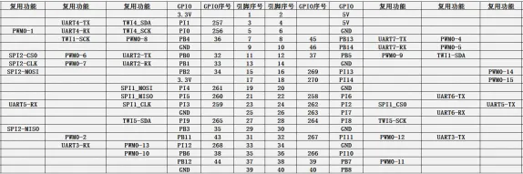
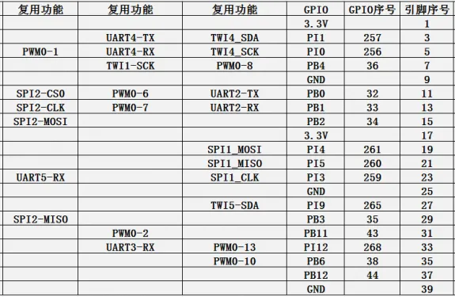
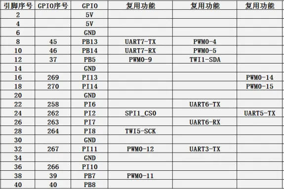
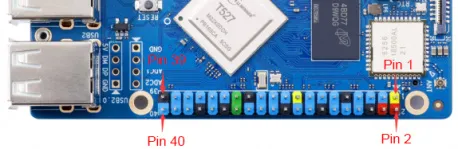

# Orange Pi 4A

**Orange Pi** · Other SBC

Revision: Not identified  
Coverage: Pinout image collected

[Browse all manufacturers](../../../../BROWSE.md) · [Desktop app](https://github.com/valleytechsolutions/black-wire-desktop)

## GPIO pin-function reference SBCX-039

**pinout image** · Reviewed source · PNG

[Open original reference](../../../../library/media/ffc399fb0a58f8ed7194d330f6d2ca170039131ce582f9e8f57905a4673a2288.png)

**Credit and rights:** Not established; source attribution retained. Source/manufacturer: Orange Pi.

[Source 1](http://www.orangepi.org/orangepiwiki/images/thumb/e/ec/Orange_Pi_4A-image152.png/574px-Orange_Pi_4A-image152.png) · [Source 2](http://www.orangepi.org/orangepiwiki/index.php/Orange_Pi_4A)

40 Pin Interface Pin Description

SHA-256: `ffc399fb0a58f8ed7194d330f6d2ca170039131ce582f9e8f57905a4673a2288`

## GPIO pin-function reference SBCX-040

**pinout image** · Reviewed source · PNG

[Open original reference](../../../../library/media/5834a21655971022763115b668696a803f313d6f84f284247626ca9d1ba3a56e.png)

**Credit and rights:** Not established; source attribution retained. Source/manufacturer: Orange Pi.

[Source 1](http://www.orangepi.org/orangepiwiki/images/thumb/e/e3/Orange_Pi_4A-image153.png/575px-Orange_Pi_4A-image153.png) · [Source 2](http://www.orangepi.org/orangepiwiki/index.php/Orange_Pi_4A)

40 Pin Interface Pin Description

SHA-256: `5834a21655971022763115b668696a803f313d6f84f284247626ca9d1ba3a56e`

## GPIO pin-function reference SBCX-041

**pinout image** · Reviewed source · PNG

[Open original reference](../../../../library/media/5e09c6b8c497dc606455a63291b50e2d5b8b642a98317f214a2a190f6b947b8b.png)

**Credit and rights:** Not established; source attribution retained. Source/manufacturer: Orange Pi.

[Source 1](http://www.orangepi.org/orangepiwiki/images/thumb/7/70/Orange_Pi_4A-image154.png/575px-Orange_Pi_4A-image154.png) · [Source 2](http://www.orangepi.org/orangepiwiki/index.php/Orange_Pi_4A)

40 Pin Interface Pin Description

SHA-256: `5e09c6b8c497dc606455a63291b50e2d5b8b642a98317f214a2a190f6b947b8b`

## Header orientation and board labels

**board labeling image** · Reviewed source · JPG

[Open original reference](../../../../library/media/9270ed5ec1b38aba384099065bb8f2d9e25cdd4ec4005a72eb0e7522124a90fb.jpg)

**Credit and rights:** Not established; source attribution retained. Source/manufacturer: Orange Pi.

[Source 1](http://www.orangepi.org/orangepiwiki/images/thumb/d/d1/Orange_Pi_4A-image151.jpeg/458px-Orange_Pi_4A-image151.jpeg) · [Source 2](http://www.orangepi.org/orangepiwiki/index.php/Orange_Pi_4A)

40 Pin Interface Pin Description

SHA-256: `9270ed5ec1b38aba384099065bb8f2d9e25cdd4ec4005a72eb0e7522124a90fb`

Pin assignments have not been independently electrically verified. Check board revision before wiring.
