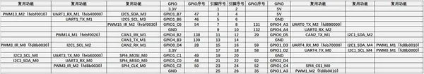
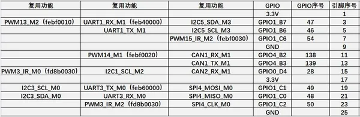
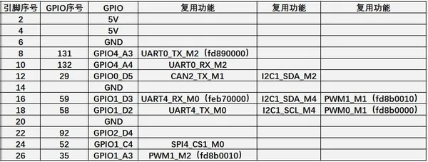
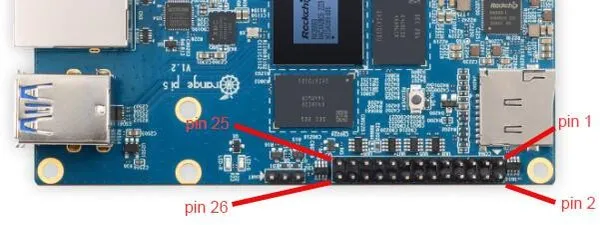

# Orange Pi 5

**Orange Pi** · Other SBC

Revision: Not identified  
Coverage: Pinout image collected

[Browse all manufacturers](../../../../BROWSE.md) · [Desktop app](https://github.com/valleytechsolutions/black-wire-desktop)

## GPIO pin-function reference SBCX-077

**pinout image** · Reviewed source · JPG

[Open original reference](../../../../library/media/46124b9678a43c610a74d554118bd439671442fae99a7a7df7a92d70823a618a.jpg)

**Credit and rights:** Not established; source attribution retained. Source/manufacturer: Orange Pi.

[Source 1](http://www.orangepi.org/orangepiwiki/images/0/01/Pi-5-details2-pic18.png) · [Source 2](http://www.orangepi.org/orangepiwiki/index.php/26_Pin_Interface_Pin_Description)

SHA-256: `46124b9678a43c610a74d554118bd439671442fae99a7a7df7a92d70823a618a`

## GPIO pin-function reference SBCX-078

**pinout image** · Reviewed source · JPG

[Open original reference](../../../../library/media/c2b2d015504cc0bc36530e9a374e83670737abf337dc2d3be0a4f6d8795df74b.jpg)

**Credit and rights:** Not established; source attribution retained. Source/manufacturer: Orange Pi.

[Source 1](http://www.orangepi.org/orangepiwiki/images/e/eb/Pi-5-details2-pic19.png) · [Source 2](http://www.orangepi.org/orangepiwiki/index.php/26_Pin_Interface_Pin_Description)

SHA-256: `c2b2d015504cc0bc36530e9a374e83670737abf337dc2d3be0a4f6d8795df74b`

## GPIO pin-function reference SBCX-079

**pinout image** · Reviewed source · JPG

[Open original reference](../../../../library/media/2909da3c99135bc36ed3326373309c9d5432971dda45d3c1258012b15cdd0960.jpg)

**Credit and rights:** Not established; source attribution retained. Source/manufacturer: Orange Pi.

[Source 1](http://www.orangepi.org/orangepiwiki/images/8/81/Pi-5-details2-pic20.png) · [Source 2](http://www.orangepi.org/orangepiwiki/index.php/26_Pin_Interface_Pin_Description)

SHA-256: `2909da3c99135bc36ed3326373309c9d5432971dda45d3c1258012b15cdd0960`

## Header orientation and board labels

**board labeling image** · Reviewed source · JPG

[Open original reference](../../../../library/media/59e2f64ebcadf0c43af6cc79dcb09b935136ca2857f2c6f090a4921d68404dd6.jpg)

**Credit and rights:** Not established; source attribution retained. Source/manufacturer: Orange Pi.

[Source 1](http://www.orangepi.org/orangepiwiki/images/d/d8/Pi-5-details2-pic17.png) · [Source 2](http://www.orangepi.org/orangepiwiki/index.php/26_Pin_Interface_Pin_Description)

SHA-256: `59e2f64ebcadf0c43af6cc79dcb09b935136ca2857f2c6f090a4921d68404dd6`

Pin assignments have not been independently electrically verified. Check board revision before wiring.
