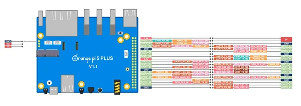
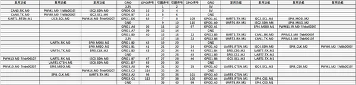
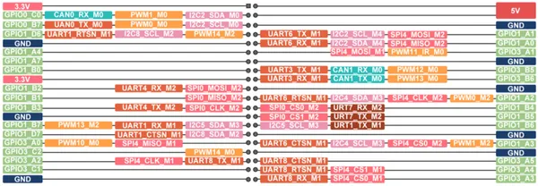
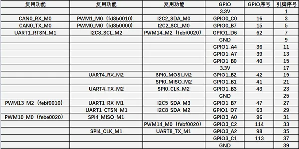
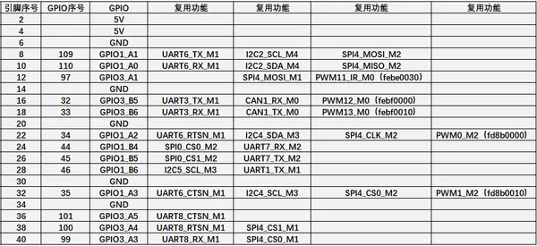
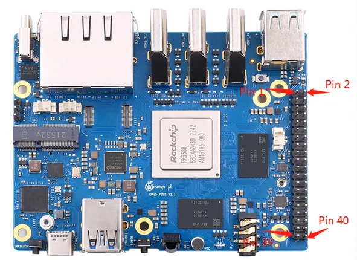

# Orange Pi 5 Plus

**Orange Pi** · Other SBC

Revision: Not identified  
Coverage: Pinout image collected

[Browse all manufacturers](../../../../BROWSE.md) · [Desktop app](https://github.com/valleytechsolutions/black-wire-desktop)

## GPIO header pinout

**pinout image** · Reviewed source · JPG

[Open original reference](../../../../library/media/664b5607d364f0d55fb412612c373480fcba7ac2626da4518f20c1a3716ccb10.jpg)

**Credit and rights:** Not established; source attribution retained. Source/manufacturer: Orange Pi.

[Source 1](http://www.orangepi.org/orangepiwiki/images/a/ac/Plus5-img302.png) · [Source 2](http://www.orangepi.org/orangepiwiki/index.php/Orange_Pi_5_Plus)

40 Pin Expansion Interface Pin Instructions

SHA-256: `664b5607d364f0d55fb412612c373480fcba7ac2626da4518f20c1a3716ccb10`

## GPIO pin-function reference SBCX-056

**pinout image** · Reviewed source · PNG

[Open original reference](../../../../library/media/b6d4c8074ebacbd9f4f89e5a8cd059e4d2ba11cd2a95f19429dcc83f9dad963f.png)

**Credit and rights:** Not established; source attribution retained. Source/manufacturer: Orange Pi.

[Source 1](http://www.orangepi.org/orangepiwiki/images/5/50/Plus5-img304.png) · [Source 2](http://www.orangepi.org/orangepiwiki/index.php/Orange_Pi_5_Plus)

40 Pin Expansion Interface Pin Instructions

SHA-256: `b6d4c8074ebacbd9f4f89e5a8cd059e4d2ba11cd2a95f19429dcc83f9dad963f`

## GPIO header pinout

**pinout image** · Reviewed source · PNG

[Open original reference](../../../../library/media/7b353510e64b82e3353497f751b6c0b84feddddf5f1e3a01d90b09d557b33e6b.png)

**Credit and rights:** Not established; source attribution retained. Source/manufacturer: Orange Pi.

[Source 1](http://www.orangepi.org/orangepiwiki/images/b/b3/Plus5-img305.png) · [Source 2](http://www.orangepi.org/orangepiwiki/index.php/Orange_Pi_5_Plus)

40 Pin Expansion Interface Pin Instructions

SHA-256: `7b353510e64b82e3353497f751b6c0b84feddddf5f1e3a01d90b09d557b33e6b`

## GPIO pin-function reference SBCX-058

**pinout image** · Reviewed source · PNG

[Open original reference](../../../../library/media/f10160c8bbe18df73003ff262745d7329a463b309bd9bb3a9f75d47f44ecb639.png)

**Credit and rights:** Not established; source attribution retained. Source/manufacturer: Orange Pi.

[Source 1](http://www.orangepi.org/orangepiwiki/images/3/3c/Plus5-img306.png) · [Source 2](http://www.orangepi.org/orangepiwiki/index.php/Orange_Pi_5_Plus)

40 Pin Expansion Interface Pin Instructions

SHA-256: `f10160c8bbe18df73003ff262745d7329a463b309bd9bb3a9f75d47f44ecb639`

## GPIO pin-function reference SBCX-059

**pinout image** · Reviewed source · PNG

[Open original reference](../../../../library/media/e194c25f926825c9a8dc566b22e73347ad76aed54b635fcec452406534733552.png)

**Credit and rights:** Not established; source attribution retained. Source/manufacturer: Orange Pi.

[Source 1](http://www.orangepi.org/orangepiwiki/images/3/3c/Plus5-img307.png) · [Source 2](http://www.orangepi.org/orangepiwiki/index.php/Orange_Pi_5_Plus)

40 Pin Expansion Interface Pin Instructions

SHA-256: `e194c25f926825c9a8dc566b22e73347ad76aed54b635fcec452406534733552`

## Header orientation and board labels

**board labeling image** · Reviewed source · PNG

[Open original reference](../../../../library/media/7deffa8d9c959a3e39f6077ea7aff76fadee74dbd2a2f9cc8bf5c78cc56767fd.png)

**Credit and rights:** Not established; source attribution retained. Source/manufacturer: Orange Pi.

[Source 1](http://www.orangepi.org/orangepiwiki/images/7/71/Plus5-img303.png) · [Source 2](http://www.orangepi.org/orangepiwiki/index.php/Orange_Pi_5_Plus)

40 Pin Expansion Interface Pin Instructions

SHA-256: `7deffa8d9c959a3e39f6077ea7aff76fadee74dbd2a2f9cc8bf5c78cc56767fd`

Pin assignments have not been independently electrically verified. Check board revision before wiring.
