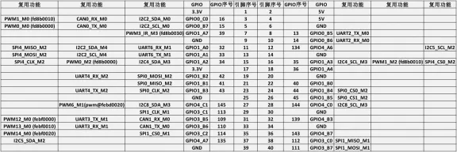
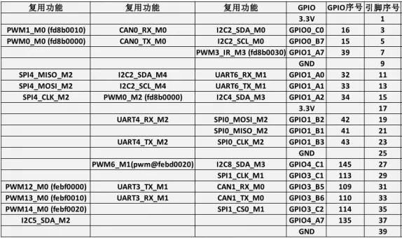
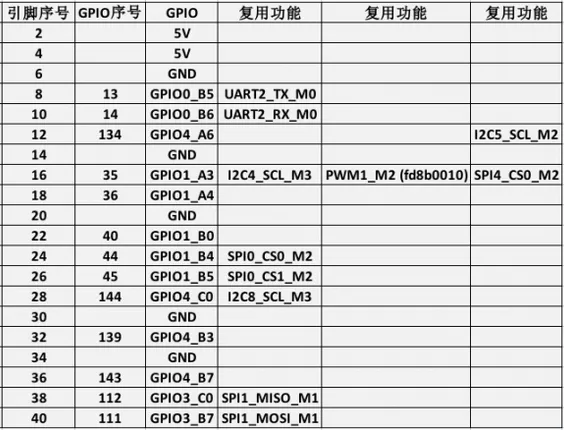
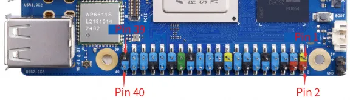

# Orange Pi 5 Ultra

**Orange Pi** · Other SBC

Revision: Not identified  
Coverage: Pinout image collected

[Browse all manufacturers](../../../../BROWSE.md) · [Desktop app](https://github.com/valleytechsolutions/black-wire-desktop)

## GPIO pin-function reference SBCX-035

**pinout image** · Reviewed source · PNG

[Open original reference](../../../../library/media/7f4b1cec2ba73e297de9c1e8b505d05b6ce6b33c58796ba1ed9528d498e186c5.png)

**Credit and rights:** Not established; source attribution retained. Source/manufacturer: Orange Pi.

[Source 1](http://www.orangepi.org/orangepiwiki/images/thumb/0/01/Orange_Pi_5_Ultra-image268.png/576px-Orange_Pi_5_Ultra-image268.png) · [Source 2](http://www.orangepi.org/orangepiwiki/index.php/Orange_Pi_5_Ultra)

40 Pin Interface Pin Description

SHA-256: `7f4b1cec2ba73e297de9c1e8b505d05b6ce6b33c58796ba1ed9528d498e186c5`

## GPIO pin-function reference SBCX-036

**pinout image** · Reviewed source · PNG

[Open original reference](../../../../library/media/57e852a4a4e323151153ba77492368a6108558891e3eb1a2071252b971ae9a2b.png)

**Credit and rights:** Not established; source attribution retained. Source/manufacturer: Orange Pi.

[Source 1](http://www.orangepi.org/orangepiwiki/images/thumb/8/8c/Orange_Pi_5_Ultra-image269.png/574px-Orange_Pi_5_Ultra-image269.png) · [Source 2](http://www.orangepi.org/orangepiwiki/index.php/Orange_Pi_5_Ultra)

40 Pin Interface Pin Description

SHA-256: `57e852a4a4e323151153ba77492368a6108558891e3eb1a2071252b971ae9a2b`

## GPIO pin-function reference SBCX-037

**pinout image** · Reviewed source · PNG

[Open original reference](../../../../library/media/d74b078f43ab03856d30aed8ed659e77d480ecc708da3b4ba91e27d1f8425dbd.png)

**Credit and rights:** Not established; source attribution retained. Source/manufacturer: Orange Pi.

[Source 1](http://www.orangepi.org/orangepiwiki/images/thumb/6/6b/Orange_Pi_5_Ultra-image270.png/575px-Orange_Pi_5_Ultra-image270.png) · [Source 2](http://www.orangepi.org/orangepiwiki/index.php/Orange_Pi_5_Ultra)

40 Pin Interface Pin Description

SHA-256: `d74b078f43ab03856d30aed8ed659e77d480ecc708da3b4ba91e27d1f8425dbd`

## Header orientation and board labels

**board labeling image** · Reviewed source · JPG

[Open original reference](../../../../library/media/645b43ddb25511d453a1dd3471bea65b85ac38e27021dee821959b51f81f5c97.jpg)

**Credit and rights:** Not established; source attribution retained. Source/manufacturer: Orange Pi.

[Source 1](http://www.orangepi.org/orangepiwiki/images/thumb/a/a6/Orange_Pi_5_Ultra-image267.jpeg/576px-Orange_Pi_5_Ultra-image267.jpeg) · [Source 2](http://www.orangepi.org/orangepiwiki/index.php/Orange_Pi_5_Ultra)

40 Pin Interface Pin Description

SHA-256: `645b43ddb25511d453a1dd3471bea65b85ac38e27021dee821959b51f81f5c97`

Pin assignments have not been independently electrically verified. Check board revision before wiring.
