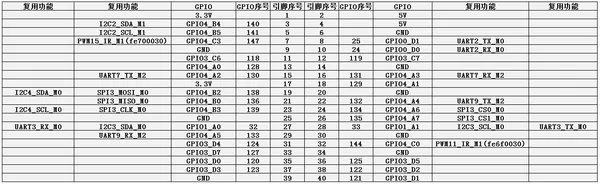
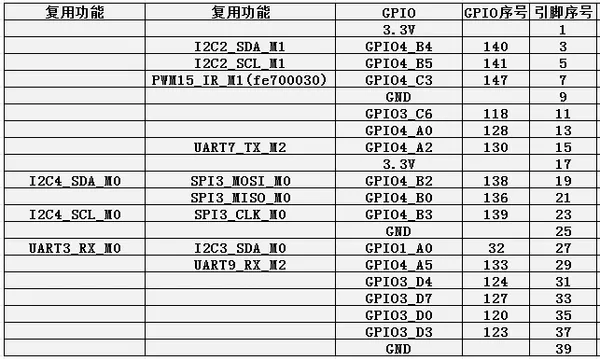
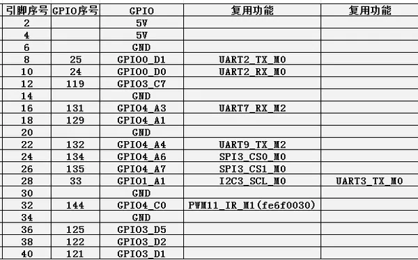
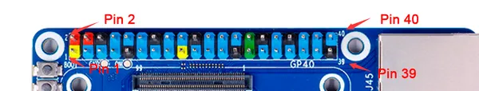

# Orange Pi CM4 with expansion board

**Orange Pi** · Other SBC

Revision: Not identified  
Coverage: Pinout image collected

[Browse all manufacturers](../../../../BROWSE.md) · [Desktop app](https://github.com/valleytechsolutions/black-wire-desktop)

## GPIO pin-function reference SBCX-048

**pinout image** · Reviewed source · PNG

[Open original reference](../../../../library/media/689ad474ef98b95d04010785569f100b8362545f683f79a5f548684b27133296.png)

**Credit and rights:** Not established; source attribution retained. Source/manufacturer: Orange Pi.

[Source 1](http://www.orangepi.org/orangepiwiki/images/e/e0/Cm4-img253.png) · [Source 2](http://www.orangepi.org/orangepiwiki/index.php/Orange_Pi_CM4)

40 Pin interface pin description

SHA-256: `689ad474ef98b95d04010785569f100b8362545f683f79a5f548684b27133296`

## GPIO pin-function reference SBCX-049

**pinout image** · Reviewed source · PNG

[Open original reference](../../../../library/media/057d44c3ffa106bf6104b7565f88e2b35866c54a7cb0db458d8f2926b1e9ad96.png)

**Credit and rights:** Not established; source attribution retained. Source/manufacturer: Orange Pi.

[Source 1](http://www.orangepi.org/orangepiwiki/images/0/0b/Cm4-img254.png) · [Source 2](http://www.orangepi.org/orangepiwiki/index.php/Orange_Pi_CM4)

40 Pin interface pin description

SHA-256: `057d44c3ffa106bf6104b7565f88e2b35866c54a7cb0db458d8f2926b1e9ad96`

## GPIO pin-function reference SBCX-050

**pinout image** · Reviewed source · PNG

[Open original reference](../../../../library/media/4596b30fadcd2f0fdfd9a7c48fd25fa8e644d4f58c01c08f9ea33f19aee4e6d9.png)

**Credit and rights:** Not established; source attribution retained. Source/manufacturer: Orange Pi.

[Source 1](http://www.orangepi.org/orangepiwiki/images/f/fa/Cm4-img255.png) · [Source 2](http://www.orangepi.org/orangepiwiki/index.php/Orange_Pi_CM4)

40 Pin interface pin description

SHA-256: `4596b30fadcd2f0fdfd9a7c48fd25fa8e644d4f58c01c08f9ea33f19aee4e6d9`

## Header orientation and board labels

**board labeling image** · Reviewed source · PNG

[Open original reference](../../../../library/media/fa06df04fca5941ecbe1a831d05d9d08a83e7b08d075eb43d958032b768f9cd8.png)

**Credit and rights:** Not established; source attribution retained. Source/manufacturer: Orange Pi.

[Source 1](http://www.orangepi.org/orangepiwiki/images/d/dc/Cm4-img252.png) · [Source 2](http://www.orangepi.org/orangepiwiki/index.php/Orange_Pi_CM4)

40 Pin interface pin description

SHA-256: `fa06df04fca5941ecbe1a831d05d9d08a83e7b08d075eb43d958032b768f9cd8`

Pin assignments have not been independently electrically verified. Check board revision before wiring.
