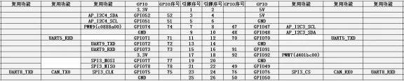
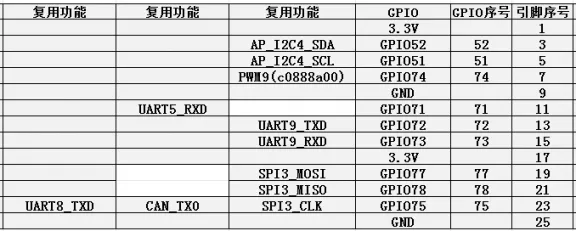
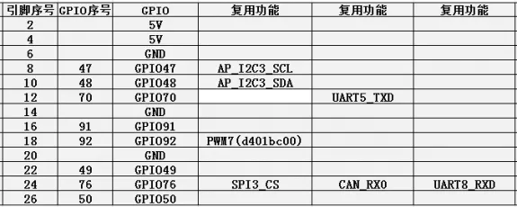
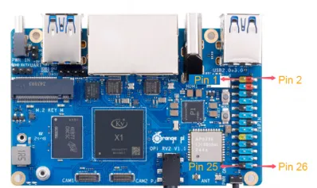

# Orange Pi RV2

**Orange Pi** · Other SBC

Revision: Not identified  
Coverage: Pinout image collected

[Browse all manufacturers](../../../../BROWSE.md) · [Desktop app](https://github.com/valleytechsolutions/black-wire-desktop)

## GPIO pin-function reference SBCX-031

**pinout image** · Reviewed source · PNG

[Open original reference](../../../../library/media/e2ea5340a7388f78fa9dd1c745d2bd213b5578270012e28765a35c4619b1ccf5.png)

**Credit and rights:** Not established; source attribution retained. Source/manufacturer: Orange Pi.

[Source 1](http://www.orangepi.org/orangepiwiki/images/thumb/b/bc/OrangePi_RV2_X1_User_Manual_v1.0.1_image147.png/576px-OrangePi_RV2_X1_User_Manual_v1.0.1_image147.png) · [Source 2](http://www.orangepi.org/orangepiwiki/index.php/Orange_Pi_RV2)

26 Pin Interface Pin Description

SHA-256: `e2ea5340a7388f78fa9dd1c745d2bd213b5578270012e28765a35c4619b1ccf5`

## GPIO pin-function reference SBCX-032

**pinout image** · Reviewed source · PNG

[Open original reference](../../../../library/media/d25c7922e27bc30665d3a28c5eebb186234926a350fe0dcf26ad96f5d71712a4.png)

**Credit and rights:** Not established; source attribution retained. Source/manufacturer: Orange Pi.

[Source 1](http://www.orangepi.org/orangepiwiki/images/thumb/3/3e/OrangePi_RV2_X1_User_Manual_v1.0.1_image148.png/576px-OrangePi_RV2_X1_User_Manual_v1.0.1_image148.png) · [Source 2](http://www.orangepi.org/orangepiwiki/index.php/Orange_Pi_RV2)

26 Pin Interface Pin Description

SHA-256: `d25c7922e27bc30665d3a28c5eebb186234926a350fe0dcf26ad96f5d71712a4`

## GPIO pin-function reference SBCX-033

**pinout image** · Reviewed source · PNG

[Open original reference](../../../../library/media/c59aa3810927088717e7ac5863d5f95488775c00972a31e2db16726874d344d5.png)

**Credit and rights:** Not established; source attribution retained. Source/manufacturer: Orange Pi.

[Source 1](http://www.orangepi.org/orangepiwiki/images/thumb/9/91/OrangePi_RV2_X1_User_Manual_v1.0.1_image149.png/575px-OrangePi_RV2_X1_User_Manual_v1.0.1_image149.png) · [Source 2](http://www.orangepi.org/orangepiwiki/index.php/Orange_Pi_RV2)

26 Pin Interface Pin Description

SHA-256: `c59aa3810927088717e7ac5863d5f95488775c00972a31e2db16726874d344d5`

## Header orientation and board labels

**board labeling image** · Reviewed source · JPG

[Open original reference](../../../../library/media/2f249bee3594eac5cd14bb8e345d870b0a693082c03604f5748851f9162ecc7f.jpg)

**Credit and rights:** Not established; source attribution retained. Source/manufacturer: Orange Pi.

[Source 1](http://www.orangepi.org/orangepiwiki/images/thumb/3/37/OrangePi_RV2_X1_User_Manual_v1.0.1_image146.jpeg/398px-OrangePi_RV2_X1_User_Manual_v1.0.1_image146.jpeg) · [Source 2](http://www.orangepi.org/orangepiwiki/index.php/Orange_Pi_RV2)

26 Pin Interface Pin Description

SHA-256: `2f249bee3594eac5cd14bb8e345d870b0a693082c03604f5748851f9162ecc7f`

Pin assignments have not been independently electrically verified. Check board revision before wiring.
