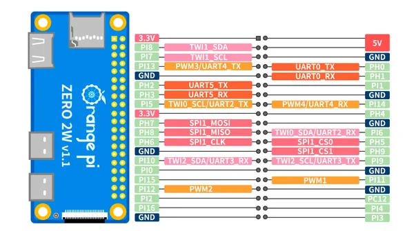
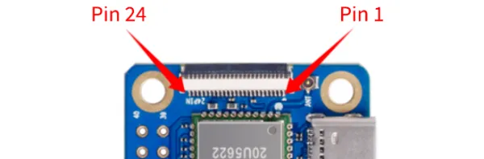
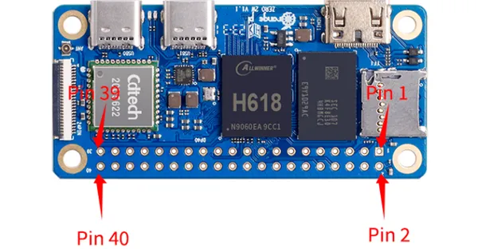

# Orange Pi Zero 2W

**Orange Pi** · Other SBC

Revision: Multiple source/revision records; see individual assets  
Coverage: Pinout image collected

[Browse all manufacturers](../../../../BROWSE.md) · [Desktop app](https://github.com/valleytechsolutions/black-wire-desktop)

## Manufacturer color board pinout

**pinout image** · Reviewed source · PNG

[Open original reference](../../../../library/media/4aac21a5560d2b25098dd798184373ee4384062a7fcbac141190f6f784d0779d.png)

**Credit and rights:** Not established; source attribution retained. Source/manufacturer: Orange Pi.

[Source 1](http://www.orangepi.org/img/zero2W/0825-zero2w-img21.png) · [Source 2](http://www.orangepi.org/html/hardWare/computerAndMicrocontrollers/details/Orange-Pi-Zero-2W.html)

SHA-256: `4aac21a5560d2b25098dd798184373ee4384062a7fcbac141190f6f784d0779d`

## Header orientation and board labels

**board labeling image** · Reviewed source · PNG

[Open original reference](../../../../library/media/ef74f1affa773f4a28508c331f02f188bc77b34d3a903b38cf7bd8eab4a8ffeb.png)

**Credit and rights:** Not established; source attribution retained. Source/manufacturer: Orange Pi.

[Source 1](http://www.orangepi.org/orangepiwiki/images/d/de/Zero2w-img102.png) · [Source 2](http://www.orangepi.org/orangepiwiki/index.php/Orange_Pi_Zero_2W)

24Pin expansion board interface pin description

SHA-256: `ef74f1affa773f4a28508c331f02f188bc77b34d3a903b38cf7bd8eab4a8ffeb`

## Header orientation and board labels

**board labeling image** · Reviewed source · PNG

[Open original reference](../../../../library/media/520a7624786d64e522a7dc131183d5eb7e35b3b111c1ad3a10b844184ba6433e.png)

**Credit and rights:** Not established; source attribution retained. Source/manufacturer: Orange Pi.

[Source 1](http://www.orangepi.org/orangepiwiki/images/d/d9/Zero2w-img169.png) · [Source 2](http://www.orangepi.org/orangepiwiki/index.php/Orange_Pi_Zero_2W)

40 Pin Interface pin description

SHA-256: `520a7624786d64e522a7dc131183d5eb7e35b3b111c1ad3a10b844184ba6433e`

Pin assignments have not been independently electrically verified. Check board revision before wiring.
