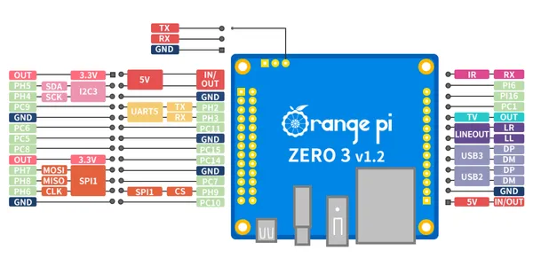
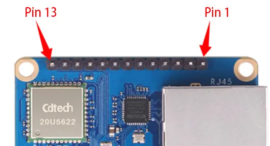
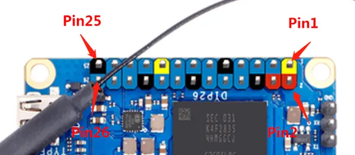

# Orange Pi Zero 3

**Orange Pi** · Other SBC

Revision: Multiple source/revision records; see individual assets  
Coverage: Pinout image collected

[Browse all manufacturers](../../../../BROWSE.md) · [Desktop app](https://github.com/valleytechsolutions/black-wire-desktop)

## Manufacturer color board pinout

**pinout image** · Reviewed source · PNG

[Open original reference](../../../../library/media/35ecccee3c213910b0340ab7ad3ac453add12a5733eb98e9424e082f51337e50.png)

**Credit and rights:** Not established; source attribution retained. Source/manufacturer: Orange Pi.

[Source 1](http://www.orangepi.org/img/zero3/0627-zero3 (7).png) · [Source 2](http://www.orangepi.org/html/hardWare/computerAndMicrocontrollers/details/Orange-Pi-Zero-3.html)

SHA-256: `35ecccee3c213910b0340ab7ad3ac453add12a5733eb98e9424e082f51337e50`

## Header orientation and board labels

**board labeling image** · Reviewed source · JPG

[Open original reference](../../../../library/media/967b31bfa68419c474a5033c8386b7a5832c99de58965ced21a6cc0e67a6360c.jpg)

**Credit and rights:** Not established; source attribution retained. Source/manufacturer: Orange Pi.

[Source 1](http://www.orangepi.org/orangepiwiki/images/4/48/Zero3-img170.png) · [Source 2](http://www.orangepi.org/orangepiwiki/index.php/Orange_Pi_Zero_3)

13 Pin Description of the Pin Expansion Board Interface

SHA-256: `967b31bfa68419c474a5033c8386b7a5832c99de58965ced21a6cc0e67a6360c`

## Header orientation and board labels

**board labeling image** · Reviewed source · PNG

[Open original reference](../../../../library/media/efad7e14c372a6771eae6231a320826f7776be4be571f713d44b9d9aeddf5f60.png)

**Credit and rights:** Not established; source attribution retained. Source/manufacturer: Orange Pi.

[Source 1](http://www.orangepi.org/orangepiwiki/images/0/00/Zero3-img171-2.png) · [Source 2](http://www.orangepi.org/orangepiwiki/index.php/Orange_Pi_Zero_3)

26 Pin Interface Pin Description

SHA-256: `efad7e14c372a6771eae6231a320826f7776be4be571f713d44b9d9aeddf5f60`

Pin assignments have not been independently electrically verified. Check board revision before wiring.
