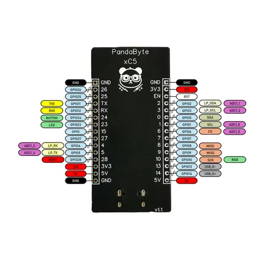

# xC5

**PandaByte** · ESP32-C5

Revision: Not identified  
Coverage: Pinout image collected

[Browse all manufacturers](../../../../BROWSE.md) · [Desktop app](https://github.com/valleytechsolutions/black-wire-desktop)

## Board pinout

**pinout image** · Reviewed source · PNG

[Open original reference](../../../../library/media/250625682413af428afdadf5fdd5261783c70ccde50502df6c31e1eaead42afd.png)

**Credit and rights:** Not established; source attribution retained. Source/manufacturer: PandaByte.

[Source 1](https://static.wixstatic.com/media/3e946a_1b9d124e19734fd28fbfcfea1ecae697~mv2.png) · [Source 2](https://www.pandabyte.in/product-page/pandabyte-xc5-esp32c5-microcontroller-board-arduino-compatible)

SHA-256: `250625682413af428afdadf5fdd5261783c70ccde50502df6c31e1eaead42afd`

Pin assignments have not been independently electrically verified. Check board revision before wiring.
