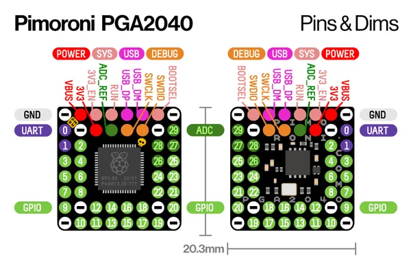

# PGA2040

**Pimoroni** · RP2040

Revision: Not identified  
Coverage: Pinout image collected

[Browse all manufacturers](../../../../BROWSE.md) · [Desktop app](https://github.com/valleytechsolutions/black-wire-desktop)

## Physical board pinout

**pinout image** · Reviewed source · PNG

[Open original reference](../../../../library/media/e9402c445108daaaccd407c8916d5e9d6f94c9dd300ea3b4e0c2e49603936c2c.png)

**Credit and rights:** Not established; source attribution retained. Source/manufacturer: Pimoroni.

[Source 1](https://cdn.shopify.com/s/files/1/0174/1800/files/pga2040_1024x1024.png?v=1625669418) · [Source 2](https://shop.pimoroni.com/products/pga2040)

Discovered from CircuitPython board metadata and the linked product/documentation page. Exact hardware revision requires matching to the diagram.

SHA-256: `e9402c445108daaaccd407c8916d5e9d6f94c9dd300ea3b4e0c2e49603936c2c`

Pin assignments have not been independently electrically verified. Check board revision before wiring.
