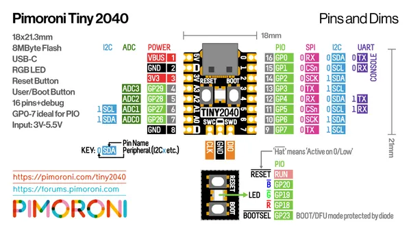

# Tiny 2040

**Pimoroni** · RP2040

Revision: Not identified  
Coverage: Pinout image collected

[Browse all manufacturers](../../../../BROWSE.md) · [Desktop app](https://github.com/valleytechsolutions/black-wire-desktop)

## Manufacturer pinout sheet

**pinout image** · Reviewed source · PNG

[Open original reference](../../../../library/media/7f5718e70af443045ad2afbee35bac169605e71d1f9f40365b3804d1d6eed685.png)

**Credit and rights:** Not established; source attribution retained. Source/manufacturer: Pimoroni.

[Source 1](https://cdn.shopify.com/s/files/1/0174/1800/files/tiny-2040-pinout-diagram_4dd9e9ab-6f6f-4b63-82d4-16793d109f17.png?v=1614260173) · [Source 2](https://shop.pimoroni.com/products/tiny-2040)

SHA-256: `7f5718e70af443045ad2afbee35bac169605e71d1f9f40365b3804d1d6eed685`

Pin assignments have not been independently electrically verified. Check board revision before wiring.
