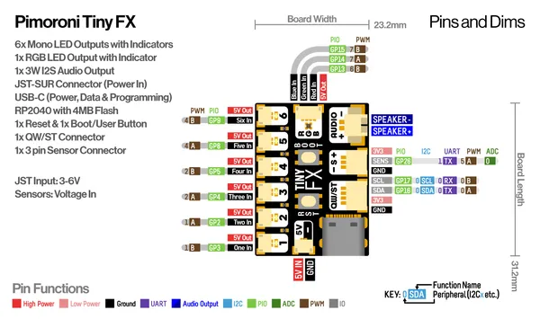
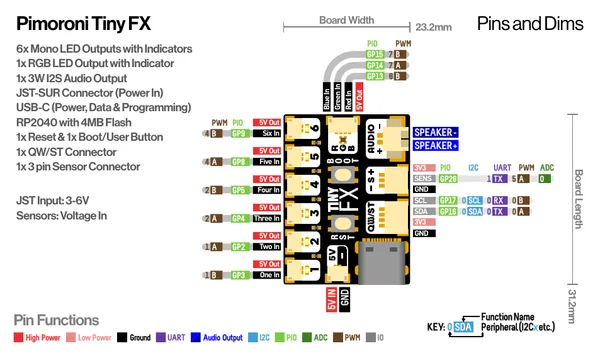

# Tiny FX

**Pimoroni** · RP2040

Revision: Not identified  
Coverage: Pinout image collected

[Browse all manufacturers](../../../../BROWSE.md) · [Desktop app](https://github.com/valleytechsolutions/black-wire-desktop)

## Physical board pinout

**pinout image** · Reviewed source · PNG

[Open original reference](../../../../library/media/2cfcd1b94f8604fede21f9fbe4431dd07228e8b59fadfd5bcf752133a6b6f4ba.png)

**Credit and rights:** Not established; source attribution retained. Source/manufacturer: Pimoroni.

[Source 1](https://cdn.shopify.com/s/files/1/0174/1800/files/tinyfx_pinout_diagram.png?v=1728573633) · [Source 2](https://shop.pimoroni.com/products/tinyfx)

Discovered from CircuitPython board metadata and the linked product/documentation page. Exact hardware revision requires matching to the diagram.

SHA-256: `2cfcd1b94f8604fede21f9fbe4431dd07228e8b59fadfd5bcf752133a6b6f4ba`

## Pinout reference - PDF page 1

**pinout image** · Reviewed source · PNG

[Open original reference](../../../../library/media/e22169cba7d76b67eaf08bd764384cd7bed17129bdd9c83351d1b4c35c7b18d1.png)

**Credit and rights:** Not established; source attribution retained. Source/manufacturer: Pimoroni.

[Source 1](https://cdn.shopify.com/s/files/1/0174/1800/files/tinyfx_pinout_diagram.pdf?v=1728573627) · [Source 2](https://shop.pimoroni.com/products/tinyfx)

Discovered from CircuitPython board metadata and the linked product/documentation page. Exact hardware revision requires matching to the diagram. Original PDF page 1 rendered at 220 dpi; no labels changed.

SHA-256: `e22169cba7d76b67eaf08bd764384cd7bed17129bdd9c83351d1b4c35c7b18d1`

## Physical board pinout

**original reference PDF** · Reviewed source · PDF

[Open original reference](../../../../library/media/2ede16a5976cb96ea97ce4b144d89312a541460899583b8428f50493d6222851.pdf)

**Credit and rights:** Not established; source attribution retained. Source/manufacturer: Pimoroni.

[Source 1](https://cdn.shopify.com/s/files/1/0174/1800/files/tinyfx_pinout_diagram.pdf?v=1728573627) · [Source 2](https://shop.pimoroni.com/products/tinyfx)

Discovered from CircuitPython board metadata and the linked product/documentation page. Exact hardware revision requires matching to the diagram.

SHA-256: `2ede16a5976cb96ea97ce4b144d89312a541460899583b8428f50493d6222851`

Pin assignments have not been independently electrically verified. Check board revision before wiring.
