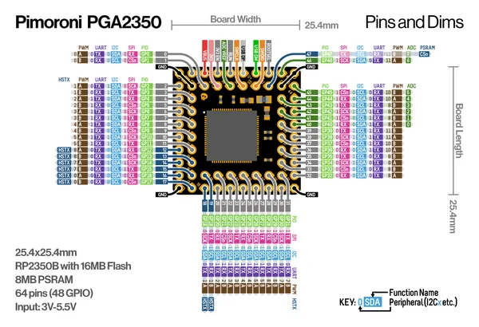
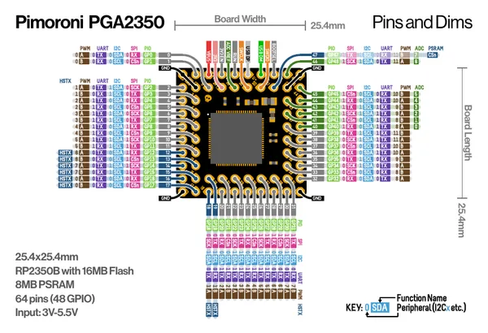

# PGA2350

**Pimoroni** · RP2350

Revision: Not identified  
Coverage: Pinout image collected

[Browse all manufacturers](../../../../BROWSE.md) · [Desktop app](https://github.com/valleytechsolutions/black-wire-desktop)

## Manufacturer pinout sheet

**pinout image** · Reviewed source · PNG

[Open original reference](../../../../library/media/7f3e6a7fbdfc1367c658a254974f63701715170611e9088f9fb67e88533906e4.png)

**Credit and rights:** Not established; source attribution retained. Source/manufacturer: Pimoroni.

[Source 1](https://cdn.shopify.com/s/files/1/0174/1800/files/pga2350_pinout_diagram.png?v=1723124466) · [Source 2](https://shop.pimoroni.com/products/pga2350)

SHA-256: `7f3e6a7fbdfc1367c658a254974f63701715170611e9088f9fb67e88533906e4`

## Pinout reference - PDF page 1

**pinout image** · Reviewed source · PNG

[Open original reference](../../../../library/media/575855aec75f2928acd3ff41b49a81235f5eed430a6c46bab2517490da56aa63.png)

**Credit and rights:** Not established; source attribution retained. Source/manufacturer: Pimoroni.

[Source 1](https://cdn.shopify.com/s/files/1/0174/1800/files/pga2350_pinout_diagram.pdf?v=1723124465) · [Source 2](https://shop.pimoroni.com/products/pga2350)

 Original PDF page 1 rendered at 220 dpi; no labels changed.

SHA-256: `575855aec75f2928acd3ff41b49a81235f5eed430a6c46bab2517490da56aa63`

## Manufacturer pinout sheet

**original reference PDF** · Reviewed source · PDF

[Open original reference](../../../../library/media/2351f7cf4d88596f387ac390d0447c6159fc85d11663a2864f6f5d9156c75e46.pdf)

**Credit and rights:** Not established; source attribution retained. Source/manufacturer: Pimoroni.

[Source 1](https://cdn.shopify.com/s/files/1/0174/1800/files/pga2350_pinout_diagram.pdf?v=1723124465) · [Source 2](https://shop.pimoroni.com/products/pga2350)

SHA-256: `2351f7cf4d88596f387ac390d0447c6159fc85d11663a2864f6f5d9156c75e46`

Pin assignments have not been independently electrically verified. Check board revision before wiring.
