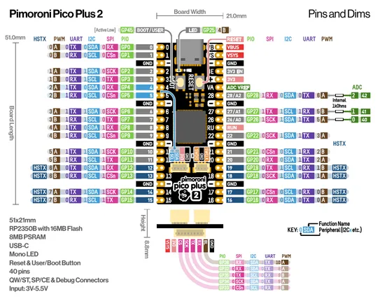

# Pico Plus 2

**Pimoroni** · RP2350

Revision: Not identified  
Coverage: Pinout image collected

[Browse all manufacturers](../../../../BROWSE.md) · [Desktop app](https://github.com/valleytechsolutions/black-wire-desktop)

## Manufacturer pinout sheet

**pinout image** · Reviewed source · PNG

[Open original reference](../../../../library/media/65e8c30f4c1b47713d1d8ff2409bb1d4fe34cf548c7e0228a8bcb1fb966744a1.png)

**Credit and rights:** Not established; source attribution retained. Source/manufacturer: Pimoroni.

[Source 1](https://cdn.shopify.com/s/files/1/0174/1800/files/ppico_plus_2_pinout_diagram.png?v=1723557327) · [Source 2](https://shop.pimoroni.com/products/pimoroni-pico-plus-2)

SHA-256: `65e8c30f4c1b47713d1d8ff2409bb1d4fe34cf548c7e0228a8bcb1fb966744a1`

## Pinout reference - PDF page 1

**pinout image** · Reviewed source · PNG

[Open original reference](../../../../library/media/4ee82187cd2fe4723a7abc140e2d9515a9c24c44399337bc087eca213a9838d8.png)

**Credit and rights:** Not established; source attribution retained. Source/manufacturer: Pimoroni.

[Source 1](https://cdn.shopify.com/s/files/1/0174/1800/files/ppico_plus_2_pinout_diagram.pdf?v=1723557334) · [Source 2](https://shop.pimoroni.com/products/pimoroni-pico-plus-2)

 Original PDF page 1 rendered at 220 dpi; no labels changed.

SHA-256: `4ee82187cd2fe4723a7abc140e2d9515a9c24c44399337bc087eca213a9838d8`

## Manufacturer pinout sheet

**original reference PDF** · Reviewed source · PDF

[Open original reference](../../../../library/media/b430f43963c1dc975ccd98e703013e755b221cf6871fafe36c724f1dd4153728.pdf)

**Credit and rights:** Not established; source attribution retained. Source/manufacturer: Pimoroni.

[Source 1](https://cdn.shopify.com/s/files/1/0174/1800/files/ppico_plus_2_pinout_diagram.pdf?v=1723557334) · [Source 2](https://shop.pimoroni.com/products/pimoroni-pico-plus-2)

SHA-256: `b430f43963c1dc975ccd98e703013e755b221cf6871fafe36c724f1dd4153728`

Pin assignments have not been independently electrically verified. Check board revision before wiring.
