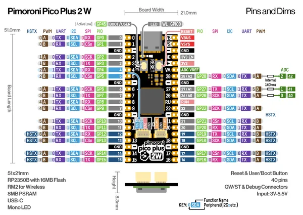
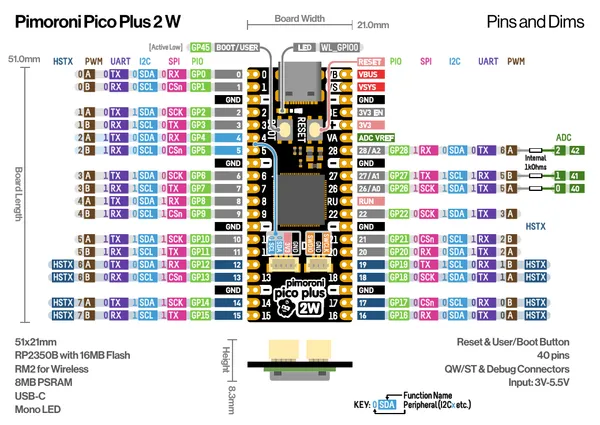

# Pico Plus 2 W

**Pimoroni** · RP2350

Revision: Not identified  
Coverage: Pinout image collected

[Browse all manufacturers](../../../../BROWSE.md) · [Desktop app](https://github.com/valleytechsolutions/black-wire-desktop)

## Manufacturer pinout sheet

**pinout image** · Reviewed source · PNG

[Open original reference](../../../../library/media/cc43427d27acda258897c10ec5f63a40a74196438814b84a2a444603236f7bd5.png)

**Credit and rights:** Not established; source attribution retained. Source/manufacturer: Pimoroni.

[Source 1](https://cdn.shopify.com/s/files/1/0174/1800/files/ppico_plus_2_w_pinout_diagram.png?v=1727346318) · [Source 2](https://shop.pimoroni.com/products/pimoroni-pico-plus-2-w)

SHA-256: `cc43427d27acda258897c10ec5f63a40a74196438814b84a2a444603236f7bd5`

## Pinout reference - PDF page 1

**pinout image** · Reviewed source · PNG

[Open original reference](../../../../library/media/b26e478ece7bfbb369ac3473ad01899a4d54b0530940f2b19b5133c3a99d0534.png)

**Credit and rights:** Not established; source attribution retained. Source/manufacturer: Pimoroni.

[Source 1](https://cdn.shopify.com/s/files/1/0174/1800/files/ppico_plus_2_w_pinout_diagram.pdf?v=1727346378) · [Source 2](https://shop.pimoroni.com/products/pimoroni-pico-plus-2-w)

 Original PDF page 1 rendered at 220 dpi; no labels changed.

SHA-256: `b26e478ece7bfbb369ac3473ad01899a4d54b0530940f2b19b5133c3a99d0534`

## Manufacturer pinout sheet

**original reference PDF** · Reviewed source · PDF

[Open original reference](../../../../library/media/8511d1d306a608918a55696ab4db26a89fbbfc2838e7fc693148b5f53926ebd4.pdf)

**Credit and rights:** Not established; source attribution retained. Source/manufacturer: Pimoroni.

[Source 1](https://cdn.shopify.com/s/files/1/0174/1800/files/ppico_plus_2_w_pinout_diagram.pdf?v=1727346378) · [Source 2](https://shop.pimoroni.com/products/pimoroni-pico-plus-2-w)

SHA-256: `8511d1d306a608918a55696ab4db26a89fbbfc2838e7fc693148b5f53926ebd4`

Pin assignments have not been independently electrically verified. Check board revision before wiring.
