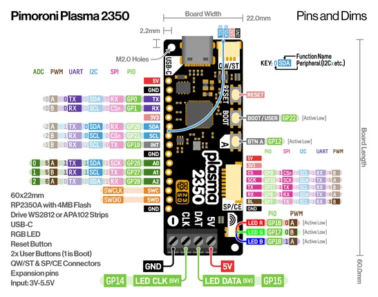
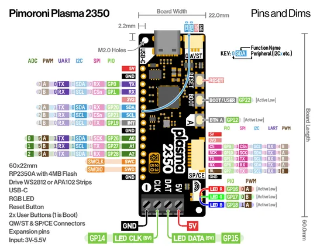

# Plasma 2350

**Pimoroni** · RP2350

Revision: Not identified  
Coverage: Pinout image collected

[Browse all manufacturers](../../../../BROWSE.md) · [Desktop app](https://github.com/valleytechsolutions/black-wire-desktop)

## Manufacturer pinout sheet

**pinout image** · Reviewed source · PNG

[Open original reference](../../../../library/media/6fd0c9f1d0cdd5072ee9ead1812fff3707d1cdf79957c7923790df9f81bd468c.png)

**Credit and rights:** Not established; source attribution retained. Source/manufacturer: Pimoroni.

[Source 1](https://cdn.shopify.com/s/files/1/0174/1800/files/plasma2350_pinout_diagram.png?v=1723124466) · [Source 2](https://shop.pimoroni.com/products/plasma-2350)

SHA-256: `6fd0c9f1d0cdd5072ee9ead1812fff3707d1cdf79957c7923790df9f81bd468c`

## Pinout reference - PDF page 1

**pinout image** · Reviewed source · PNG

[Open original reference](../../../../library/media/cbf2e29f511e37f140288c7e1f8b051b8f6ad53538f55500a82fe3c314d4808c.png)

**Credit and rights:** Not established; source attribution retained. Source/manufacturer: Pimoroni.

[Source 1](https://cdn.shopify.com/s/files/1/0174/1800/files/plasma2350_pinout_diagram.pdf?v=1723124465) · [Source 2](https://shop.pimoroni.com/products/plasma-2350)

 Original PDF page 1 rendered at 220 dpi; no labels changed.

SHA-256: `cbf2e29f511e37f140288c7e1f8b051b8f6ad53538f55500a82fe3c314d4808c`

## Manufacturer pinout sheet

**original reference PDF** · Reviewed source · PDF

[Open original reference](../../../../library/media/b252a11d524cda45451aef080f154d0989617857b35823b49898203c59020ecc.pdf)

**Credit and rights:** Not established; source attribution retained. Source/manufacturer: Pimoroni.

[Source 1](https://cdn.shopify.com/s/files/1/0174/1800/files/plasma2350_pinout_diagram.pdf?v=1723124465) · [Source 2](https://shop.pimoroni.com/products/plasma-2350)

SHA-256: `b252a11d524cda45451aef080f154d0989617857b35823b49898203c59020ecc`

Pin assignments have not been independently electrically verified. Check board revision before wiring.
