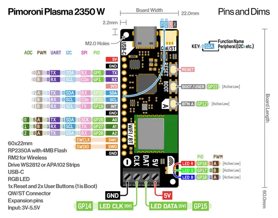

# Plasma 2350 W

**Pimoroni** · RP2350

Revision: Not identified  
Coverage: Pinout image collected

[Browse all manufacturers](../../../../BROWSE.md) · [Desktop app](https://github.com/valleytechsolutions/black-wire-desktop)

## Physical board pinout

**pinout image** · Reviewed source · PNG

[Open original reference](../../../../library/media/6ba60984f210967364a46d803a9c7fe2a801534a84f7164ee8088f4a73479046.png)

**Credit and rights:** Not established; source attribution retained. Source/manufacturer: Pimoroni.

[Source 1](https://cdn.shopify.com/s/files/1/0174/1800/files/plasma2350_w_pinout_diagram.png?v=1732206534) · [Source 2](https://shop.pimoroni.com/products/plasma-2350-w)

Discovered from CircuitPython board metadata and the linked product/documentation page. Exact hardware revision requires matching to the diagram.

SHA-256: `6ba60984f210967364a46d803a9c7fe2a801534a84f7164ee8088f4a73479046`

Pin assignments have not been independently electrically verified. Check board revision before wiring.
