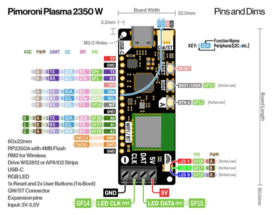

# Plasma 2350 W

**Pimoroni** · RP2350

Revision: Not identified

Coverage: Pinout image collected

[Browse all manufacturers](../../../../BROWSE.md) · [Devices & IoT](../../../../DEVICES.md) · [Open in the browser guide](https://valleytech-black-wire-guide.pages.dev/?board=pimoroni-rp2350-plasma-2350-w)

## Datasheets and original documentation

Board datasheet: **not yet recorded**. Visual reference: **available**.

[Manufacturer source (recorded link)](https://shop.pimoroni.com/products/plasma-2350-w)

A chip datasheet, schematic and board datasheet have different scopes. Match the exact hardware revision.

[Documentation coverage and remaining gaps](../../../../DOCUMENTATION.md)

## Physical board pinout

**pinout image** · Reviewed source · PNG

[Open original reference](../../../../library/media/6ba60984f210967364a46d803a9c7fe2a801534a84f7164ee8088f4a73479046.png)

**Credit and rights:** Not established; source attribution retained. Source/manufacturer: Pimoroni.

[Source 1](https://cdn.shopify.com/s/files/1/0174/1800/files/plasma2350_w_pinout_diagram.png?v=1732206534) · [Source 2](https://shop.pimoroni.com/products/plasma-2350-w)

Discovered from CircuitPython board metadata and the linked product/documentation page. Exact hardware revision requires matching to the diagram.

Image revision: Not identified

SHA-256: `6ba60984f210967364a46d803a9c7fe2a801534a84f7164ee8088f4a73479046`

Pin assignments have not been independently electrically verified. Check board revision before wiring.
