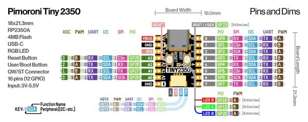
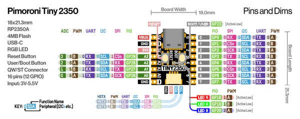

# Tiny 2350

**Pimoroni** · RP2350

Revision: Not identified  
Coverage: Pinout image collected

[Browse all manufacturers](../../../../BROWSE.md) · [Desktop app](https://github.com/valleytechsolutions/black-wire-desktop)

## Manufacturer pinout sheet

**pinout image** · Reviewed source · PNG

[Open original reference](../../../../library/media/ebafb325389ca989cba994236342b5e2e81144220c1ed82dbf899d4e80adbeea.png)

**Credit and rights:** Not established; source attribution retained. Source/manufacturer: Pimoroni.

[Source 1](https://cdn.shopify.com/s/files/1/0174/1800/files/tiny2350_pinout_diagram.png?v=1723124466) · [Source 2](https://shop.pimoroni.com/products/tiny-2350)

SHA-256: `ebafb325389ca989cba994236342b5e2e81144220c1ed82dbf899d4e80adbeea`

## Pinout reference - PDF page 1

**pinout image** · Reviewed source · PNG

[Open original reference](../../../../library/media/f20c0fe24eaacbeb41f2a162725dd0552a012c79df2ffd234153c16fffb44740.png)

**Credit and rights:** Not established; source attribution retained. Source/manufacturer: Pimoroni.

[Source 1](https://cdn.shopify.com/s/files/1/0174/1800/files/tiny2350_pinout_diagram.pdf?v=1723124465) · [Source 2](https://shop.pimoroni.com/products/tiny-2350)

 Original PDF page 1 rendered at 220 dpi; no labels changed.

SHA-256: `f20c0fe24eaacbeb41f2a162725dd0552a012c79df2ffd234153c16fffb44740`

## Manufacturer pinout sheet

**original reference PDF** · Reviewed source · PDF

[Open original reference](../../../../library/media/30145528e6d18acfd5d7b056261523815bd963cab49ba9cb3651041d9d78ac09.pdf)

**Credit and rights:** Not established; source attribution retained. Source/manufacturer: Pimoroni.

[Source 1](https://cdn.shopify.com/s/files/1/0174/1800/files/tiny2350_pinout_diagram.pdf?v=1723124465) · [Source 2](https://shop.pimoroni.com/products/tiny-2350)

SHA-256: `30145528e6d18acfd5d7b056261523815bd963cab49ba9cb3651041d9d78ac09`

Pin assignments have not been independently electrically verified. Check board revision before wiring.
