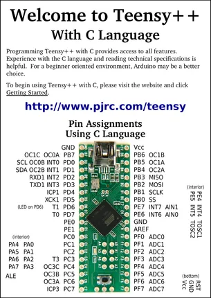
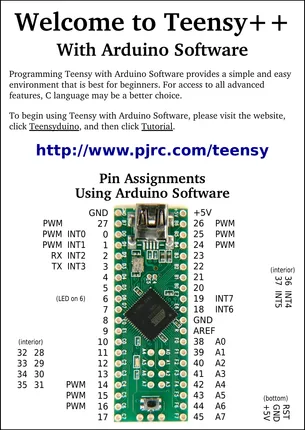

# Teensy++ 1.0

**PJRC** · AVR

Revision: Not identified  
Coverage: Pinout image collected

[Browse all manufacturers](../../../../BROWSE.md) · [Desktop app](https://github.com/valleytechsolutions/black-wire-desktop)

## Pin Assignments, Using C Language

**pinout image** · Reviewed source · PNG

[Open original reference](../../../../library/media/1d3917b8408183859e752f3ebf57ac5e2e686da0b8b2fafb177d7cca529afece.png)

**Credit and rights:** Not established; source attribution retained. Source/manufacturer: PJRC.

[Source 1](https://www.pjrc.com/teensy/card3a.pdf) · [Source 2](https://www.pjrc.com/teensy/pinout.html)

 Original PDF page 1 rendered at 220 dpi; no labels changed.

SHA-256: `1d3917b8408183859e752f3ebf57ac5e2e686da0b8b2fafb177d7cca529afece`

## Pin Assignments, Using Arduino Software

**pinout image** · Reviewed source · PNG

[Open original reference](../../../../library/media/d97412811dcc1857dc331137da6d3d5a66efb74b5e56e2e992041ba4e1786eac.png)

**Credit and rights:** Not established; source attribution retained. Source/manufacturer: PJRC.

[Source 1](https://www.pjrc.com/teensy/card3b.pdf) · [Source 2](https://www.pjrc.com/teensy/pinout.html)

 Original PDF page 1 rendered at 220 dpi; no labels changed.

SHA-256: `d97412811dcc1857dc331137da6d3d5a66efb74b5e56e2e992041ba4e1786eac`

## Pin Assignments, Using C Language

**original reference PDF** · Reviewed source · PDF

[Open original reference](../../../../library/media/71eeebae466047a12e5c5a7f1e463a4b8d179fc1ae6686c87e99d5b77a3e7b81.pdf)

**Credit and rights:** Not established; source attribution retained. Source/manufacturer: PJRC.

[Source 1](https://www.pjrc.com/teensy/card3a.pdf) · [Source 2](https://www.pjrc.com/teensy/pinout.html)

SHA-256: `71eeebae466047a12e5c5a7f1e463a4b8d179fc1ae6686c87e99d5b77a3e7b81`

## Pin Assignments, Using Arduino Software

**original reference PDF** · Reviewed source · PDF

[Open original reference](../../../../library/media/edf8d7ff0f98c5cda745e2ff50e5953a47a0030b68e35a8731d07d619bc669fd.pdf)

**Credit and rights:** Not established; source attribution retained. Source/manufacturer: PJRC.

[Source 1](https://www.pjrc.com/teensy/card3b.pdf) · [Source 2](https://www.pjrc.com/teensy/pinout.html)

SHA-256: `edf8d7ff0f98c5cda745e2ff50e5953a47a0030b68e35a8731d07d619bc669fd`

Pin assignments have not been independently electrically verified. Check board revision before wiring.
